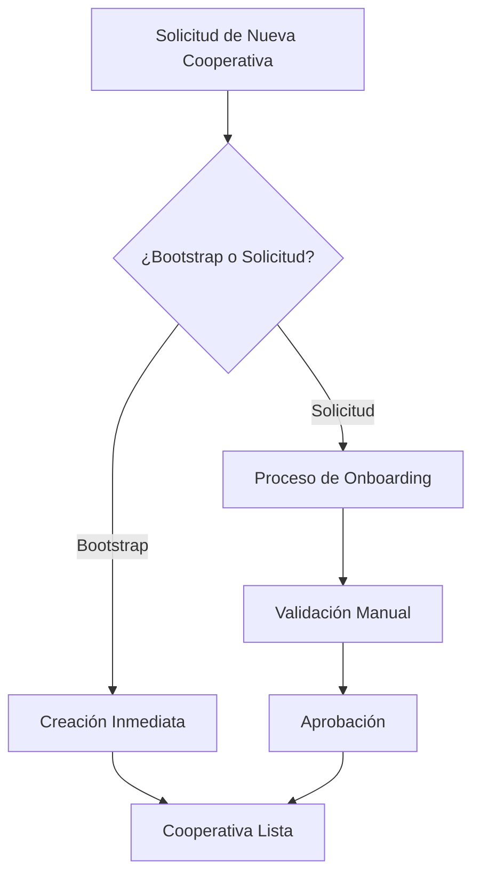

# ⚙️ 02. Configuración Inicial

Guías paso a paso para configurar cooperativas desde cero.

## 📋 **Orden de Lectura Recomendado**

### 1. **bootstrap-cooperativa.md** 🚀
- **¿Qué es?** Cómo crear una cooperativa nueva en el sistema
- **¿Para quién?** Administradores del sistema y DevOps
- **¿Cuándo usar?** Al configurar una nueva cooperativa
- **Contenido clave:**
  - Endpoint de bootstrap
  - Configuración de super admin
  - Servicios básicos

### 2. **flujo-solicitud-cooperativas.md** 📋
- **¿Qué es?** Proceso completo de solicitud de nuevas cooperativas
- **¿Para quién?** Product managers y administradores
- **¿Cuándo usar?** Para entender el flujo de incorporación
- **Contenido clave:**
  - Flujo de solicitudes
  - Validaciones requeridas
  - Estados del proceso

---

## 🎯 **Casos de Uso Principales**

### **Caso 1: Nueva Cooperativa Completa**
```http
POST /cooperativas/bootstrap
```
✅ Crea cooperativa + super admin + configuración básica

### **Caso 2: Solicitud con Onboarding**
```http
POST /cooperativas/solicitar-acceso
```
✅ Inicia proceso de validación y onboarding

### **Caso 3: Cooperativa Simple (Testing)**
```http
POST /cooperativas/create-simple
```
✅ Solo para desarrollo y testing

---

## ⚠️ **Consideraciones Importantes**

### **Datos Requeridos**
- ✅ CUIT único (validado con AFIP)
- ✅ Email de contacto válido
- ✅ Datos del administrador
- ✅ Información fiscal completa

### **Validaciones Automáticas**
- 📋 CUIT no duplicado
- 📧 Email único para administrador
- 🏢 Datos de la cooperativa completos
- 🔐 Configuración de seguridad inicial

---

## 🔄 **Flujo Típico**



---

## 🚀 **Próximo Paso**

Una vez configurada la cooperativa:
👉 **03-autenticacion/** para configurar usuarios y permisos.

---

*¡Aquí empiezas a dar vida a tu cooperativa!* 🏗️