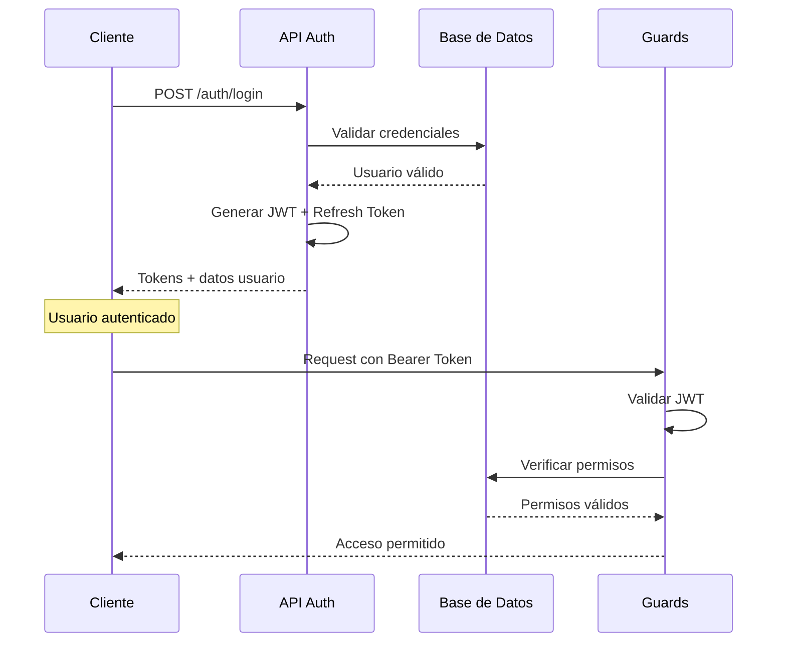

# 🔐 03. Autenticación

Sistema completo de login, usuarios, roles y permisos.

## 📋 **Orden de Lectura Recomendado**

### 1. **auth-module.md** 🎯
- **¿Qué es?** Módulo principal de autenticación
- **¿Para quién?** Desarrolladores frontend y backend
- **¿Cuándo usar?** Para implementar login y gestión de sesiones
- **Contenido clave:**
  - Endpoints de login/logout
  - JWT tokens
  - Validación de permisos

### 2. **super-admin-login.md** 👑
- **¿Qué es?** Sistema de super administradores
- **¿Para quién?** Administradores del sistema
- **¿Cuándo usar?** Para gestión multi-cooperativa
- **Contenido clave:**
  - Login especial super admin
  - Permisos globales
  - Gestión de múltiples cooperativas

### 3. **refresh-tokens-summary.md** 🔄
- **¿Qué es?** Gestión de tokens de actualización
- **¿Para quién?** Desarrolladores frontend
- **¿Cuándo usar?** Para mantener sesiones activas
- **Contenido clave:**
  - Renovación automática de tokens
  - Gestión de sesiones
  - Seguridad de tokens

---

## 🎯 **Tipos de Usuario**

### **👥 Socios (Usuarios Regulares)**
```http
POST /auth/login
{
  "email": "socio@cooperativa.com",
  "password": "password",
  "cooperativaId": "uuid-cooperativa"
}
```
- ✅ Acceso a servicios de su cooperativa
- ✅ Portal de autogestión
- ✅ Consulta de facturas y consumos

### **👨‍💼 Empleados/Administradores**
```http
POST /auth/login  
{
  "email": "admin@cooperativa.com", 
  "password": "password",
  "cooperativaId": "uuid-cooperativa"
}
```
- ✅ Gestión completa de la cooperativa
- ✅ Administración de socios
- ✅ Configuración del sistema

### **👑 Super Administradores**
```http
POST /auth/super-admin/login
{
  "email": "superadmin@sistema.com",
  "password": "password"
}
```
- ✅ Acceso a múltiples cooperativas
- ✅ Gestión del sistema completo
- ✅ Configuraciones globales

---

## 🛡️ **Sistema de Permisos**

### **Estructura RBAC (Role-Based Access Control)**
```
Usuario → Roles → Permisos → Secciones
```

### **Roles Predefinidos**
- **SOCIO** - Autogestión básica
- **EMPLEADO** - Operaciones diarias  
- **ADMIN** - Administración completa
- **SUPER_ADMIN** - Sistema completo

### **Secciones del Sistema**
- `usuarios` - Gestión de usuarios
- `personas` - Gestión de socios
- `inmuebles` - Gestión de propiedades
- `facturas` - Sistema de facturación
- `pagos` - Gestión de pagos
- `reportes` - Generación de reportes

---

## 🔄 **Flujo de Autenticación**



---

## 🔑 **Ejemplos Prácticos**

### **Login Básico (Socio)**
```typescript
const response = await fetch('/auth/login', {
  method: 'POST',
  headers: { 'Content-Type': 'application/json' },
  body: JSON.stringify({
    email: 'juan.perez@email.com',
    password: 'miPassword123',
    cooperativaId: 'coop-abc-123'
  })
});

const { data } = await response.json();
// Guardar tokens
localStorage.setItem('access_token', data.tokens.access_token);
localStorage.setItem('refresh_token', data.tokens.refresh_token);
```

### **Uso de Token en Requests**
```typescript
const response = await fetch('/personas', {
  headers: {
    'Authorization': `Bearer ${localStorage.getItem('access_token')}`,
    'Content-Type': 'application/json'
  }
});
```

### **Renovación Automática**
```typescript
// Interceptor para renovación automática
axios.interceptors.response.use(
  response => response,
  async error => {
    if (error.response?.status === 401) {
      const refreshToken = localStorage.getItem('refresh_token');
      const newTokens = await refreshTokens(refreshToken);
      // Reintentar request con nuevo token
      return axios(error.config);
    }
    return Promise.reject(error);
  }
);
```

---

## ⚠️ **Seguridad**

### **Buenas Prácticas**
- ✅ Usar HTTPS en producción
- ✅ Tokens con expiración corta (15 min)
- ✅ Refresh tokens con rotación
- ✅ Validar permisos en cada endpoint
- ✅ Logout que revoque tokens

### **Validaciones**
- 🔐 Passwords hasheados con bcrypt
- 🔒 JWT firmados con secreto seguro
- 📱 Tracking de dispositivos/sesiones
- 🚫 Rate limiting en endpoints de auth

---

## 🚀 **Próximo Paso**

Con la autenticación configurada:
👉 **04-gestion-socios/** para empezar a gestionar usuarios y socios.

---

*¡La seguridad es la base de todo!* 🛡️