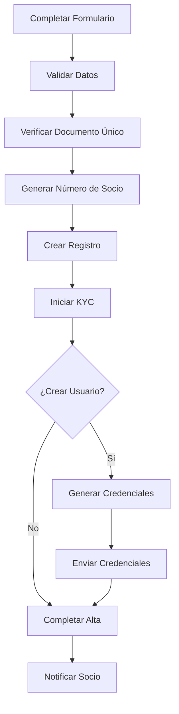
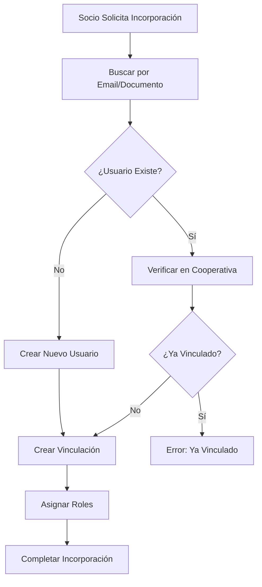

# 👥 04. Gestión de Socios

Sistema completo para administrar personas, socios y sus datos.

## 📋 **Orden de Lectura Recomendado**

### 1. **alta-socios-personas.md** 🆕
- **¿Qué es?** Guía paso a paso para dar de alta nuevos socios
- **¿Para quién?** Administradores y empleados de cooperativas
- **¿Cuándo usar?** Al incorporar nuevos socios
- **Contenido clave:**
  - Proceso completo de alta
  - Validaciones automáticas
  - Numeración de socios
  - Sistema KYC

### 2. **modulo-personas.md** 📚
- **¿Qué es?** Documentación técnica completa del módulo
- **¿Para quién?** Desarrolladores y technical leads
- **¿Cuándo usar?** Para entender toda la funcionalidad
- **Contenido clave:**
  - API completa
  - Modelos de datos
  - Casos de uso avanzados
  - Auditoría y KYC

### 3. **endpoints-consumo-socios.md** 🔌
- **¿Qué es?** Endpoints para que los socios gestionen sus datos
- **¿Para quién?** Desarrolladores frontend (portal de socios)
- **¿Cuándo usar?** Para implementar autogestión
- **Contenido clave:**
  - API de autogestión
  - Consulta de consumos
  - Actualización de datos
  - Portal de socios

---

## 🎯 **Flujos Principales**

### **Flujo 1: Alta de Nuevo Socio** 


### **Flujo 2: Vinculación Multi-Cooperativa**


---

## 👤 **Estados del Socio**

### **Estado Administrativo**
- ✅ **ACTIVO** - Socio activo en la cooperativa
- ⏸️ **SUSPENDIDO** - Temporalmente suspendido  
- ❌ **DADO_DE_BAJA** - Baja definitiva
- ⚠️ **MOROSO** - Con deudas pendientes

### **Estado KYC (Know Your Customer)**
- 📋 **PENDIENTE** - Sin documentos subidos
- 🔄 **EN_PROCESO** - Documentos en revisión
- ✅ **APROBADO** - KYC completado
- ❌ **RECHAZADO** - Requiere correcciones

---

## 📊 **Casos de Uso Comunes**

### **👨‍💼 Para Administradores**

#### **Registrar Nuevo Socio**
```http
POST /personas
{
  "nombreCompleto": "María González",
  "tipoDocumento": "DNI",
  "numeroDocumento": "12345678",
  "email": "maria@email.com",
  "telefono": "+5411234567",
  "domicilioFiscal": "Av. Principal 123",
  "localidadFiscal": "Buenos Aires",
  "provinciaFiscal": "CABA"
}
```

#### **Buscar Socios con Filtros**
```http
GET /personas?estadoKYC=PENDIENTE&localidad=Buenos Aires&pagina=1&limite=10
```

#### **Vincular Usuario Existente**
```http
POST /personas/123/vincular-usuario
{
  "email": "maria@email.com",
  "generarPassword": true,
  "enviarCredenciales": true
}
```

### **👤 Para Socios (Autogestión)**

#### **Consultar Mis Datos**
```http
GET /socios-consumo/mi-perfil
```

#### **Actualizar Información Personal**
```http
PUT /socios-consumo/mi-perfil
{
  "telefono": "+5411111111",
  "email": "nuevo.email@domain.com"
}
```

#### **Ver Mis Consumos**
```http
GET /socios-consumo/mis-consumos?meses=6
```

---

## 🔍 **Funcionalidades Avanzadas**

### **Sistema KYC Completo**
- 📄 **Documentos Requeridos**: DNI, comprobantes, selfie
- 🔍 **Validación Manual**: Por empleados autorizados
- 📊 **Tracking Completo**: Historial de estados
- ⏰ **Revisiones Periódicas**: Actualización automática

### **Multi-Tenancy de Socios**
- 👥 **Múltiples Cooperativas**: Un socio en varias cooperativas
- 🔢 **Números Únicos**: Diferente número por cooperativa
- 🎭 **Roles Específicos**: Diferentes permisos por cooperativa
- 📧 **Email Global**: Un solo email para todas las cooperativas

### **Portal de Autogestión**
- 📱 **Responsive Design**: Acceso desde cualquier dispositivo
- 🔄 **Datos en Tiempo Real**: Consumos y facturas actualizados
- 📊 **Estadísticas**: Comparativos de consumo
- 🔔 **Notificaciones**: Alertas personalizadas

---

## 📈 **Métricas y Reportes**

### **Estadísticas Disponibles**
```http
GET /personas/estadisticas
```
```json
{
  "totalSocios": 1250,
  "sociosActivos": 1180,
  "kycPendientes": 150,
  "nuevosEsteMes": 35
}
```

### **Reportes Generados**
- 📊 Altas mensuales
- 📋 Estados de KYC
- 🗺️ Distribución geográfica
- 📄 Documentación pendiente

---

## ⚠️ **Validaciones Importantes**

### **Datos Únicos**
- 📄 **Documento**: Único por cooperativa
- 🔢 **Número de Socio**: Único por cooperativa
- 📧 **Email**: Único globalmente

### **Reglas de Negocio**
- ✅ Generación automática de números de socio
- 🔒 Validación de CUIL/CUIT/DNI
- 📱 Formato de teléfonos argentinos
- 📧 Validación de emails

---

## 🚀 **Próximo Paso**

Con los socios gestionados:
👉 **05-servicios-inmuebles/** para gestionar propiedades y servicios.

---

*¡Los socios son el corazón de la cooperativa!* ❤️