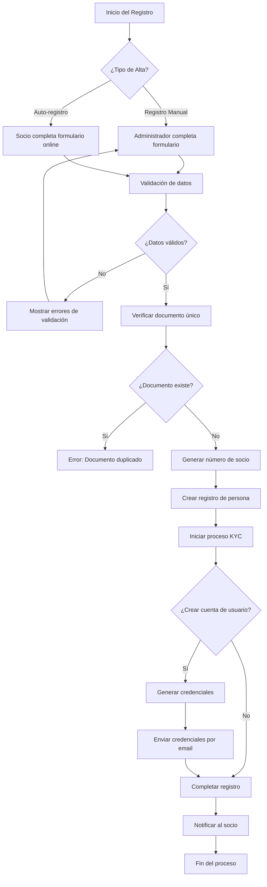

# 📋 Sistema de Alta de Socios/Personas en Cooperativas

## 📄 Descripción General

Este documento describe el proceso completo para dar de alta nuevas cuentas de socios/personas en una cooperativa. El sistema incluye validaciones automáticas, generación de números de socio, proceso KYC (Know Your Customer) y vinculación opcional con cuentas de usuario para acceso al portal web.

---

## 🎯 Objetivos del Sistema

- ✅ **Registro Completo**: Capturar toda la información necesaria del socio
- ✅ **Validación de Documentos**: Verificar datos e identidad
- ✅ **Numeración Automática**: Asignar números de socio únicos
- ✅ **Proceso KYC**: Gestionar la validación de identidad
- ✅ **Portal de Autogestión**: Crear acceso web opcional
- ✅ **Auditoría Completa**: Registrar todos los cambios

---

## 📊 Flujo del Proceso



---

## 📝 Información Requerida

### 📄 Datos Básicos Obligatorios

```json
{
  "nombreCompleto": "Juan Carlos Pérez",
  "tipoDocumento": "DNI",           // DNI | CUIL | CUIT | PASAPORTE | CI
  "numeroDocumento": "12345678",
  "categoriaIVA": "CONSUMIDOR_FINAL" // Opcional
}
```

### 👤 Datos Personales Opcionales

```json
{
  "fechaNacimiento": "1980-05-15",
  "estadoCivil": "CASADO",          // SOLTERO | CASADO | DIVORCIADO | VIUDO
  "nacionalidad": "Argentina"
}
```

### 📞 Información de Contacto

```json
{
  "telefono": "+541134567890",      // Teléfono fijo
  "telefonoMovil": "+541165432109", // Celular
  "email": "juan.perez@email.com",  // Email principal
  "emailSecundario": "j.perez@trabajo.com" // Email alternativo
}
```

### 🏠 Domicilio Actual

```json
{
  "domicilioActual": "Av. San Martín 1234",
  "pisoActual": "2° B",             // Opcional
  "codigoPostalActual": "1425",
  "localidadActual": "Capital Federal",
  "departamentoActual": "Comuna 6", // Opcional
  "provinciaActual": "CABA"
}
```

### 🏢 Domicilio Fiscal (si es diferente)

```json
{
  "domicilioFiscal": "Calle Corrientes 5678",
  "pisoFiscal": "1° A",
  "codigoPostalFiscal": "1043",
  "localidadFiscal": "Capital Federal",
  "departamentoFiscal": "Comuna 3",
  "provinciaFiscal": "CABA"
}
```

### 💼 Información Laboral

```json
{
  "ocupacion": "Ingeniero en Sistemas",
  "empresa": "TecnoSoft SA",
  "ingresosMensuales": 150000.00
}
```

### 👥 Configuración como Socio

```json
{
  "numeroSocio": "000001",          // Generado automáticamente si no se especifica
  "fechaAlta": "2024-01-15",        // Fecha actual por defecto
  "estadoSocio": "ACTIVO"           // ACTIVO | SUSPENDIDO | DADO_DE_BAJA | MOROSO
}
```

### 📋 Configuración KYC

```json
{
  "estadoKYC": "PENDIENTE",         // PENDIENTE | EN_PROCESO | APROBADO | RECHAZADO
  "requiereActualizacionKYC": false
}
```

### 🔔 Preferencias

```json
{
  "recibirNotificaciones": true,
  "recibirNotificacionesPorSMS": false,
  "recibirFacturaPorEmail": true,
  "recibirReminderPagos": true
}
```

---

## 🔧 Endpoints de la API

### 1. 📝 Crear Nuevo Socio

```http
POST /personas
Authorization: Bearer {token}
Content-Type: application/json
```

**Ejemplo de Request:**

```json
{
  "nombreCompleto": "María Elena González",
  "tipoDocumento": "DNI",
  "numeroDocumento": "87654321",
  "categoriaIVA": "CONSUMIDOR_FINAL",
  "fechaNacimiento": "1975-03-20",
  "estadoCivil": "CASADO",
  "nacionalidad": "Argentina",
  "telefono": "+541134567890",
  "telefonoMovil": "+541165432109",
  "email": "maria.gonzalez@email.com",
  "domicilioActual": "Av. Libertador 2345",
  "codigoPostalActual": "1425",
  "localidadActual": "Capital Federal",
  "provinciaActual": "CABA",
  "domicilioFiscal": "Av. Libertador 2345",
  "codigoPostalFiscal": "1425",
  "localidadFiscal": "Capital Federal",
  "provinciaFiscal": "CABA",
  "ocupacion": "Contadora",
  "empresa": "Estudio Contable ABC",
  "ingresosMensuales": 120000.00,
  "recibirNotificaciones": true,
  "recibirFacturaPorEmail": true
}
```

**Respuesta Exitosa (201):**

```json
{
  "success": true,
  "message": "Persona creada exitosamente",
  "data": {
    "id": "cm2xyz789abc",
    "nombreCompleto": "María Elena González",
    "tipoDocumento": "DNI",
    "numeroDocumento": "87654321",
    "numeroSocio": "000125",
    "estadoSocio": "ACTIVO",
    "estadoKYC": "PENDIENTE",
    "email": "maria.gonzalez@email.com",
    "telefono": "+541134567890",
    "fechaAlta": "2024-01-15T10:30:00.000Z",
    "cooperativa": {
      "id": "cm2coop123",
      "nombre": "Cooperativa de Servicios Unidos"
    },
    "cuentasAsociadas": []
  }
}
```

### 2. 🔍 Buscar Socios con Filtros

```http
GET /personas?estadoSocio=ACTIVO&estadoKYC=PENDIENTE&pagina=1&limite=10
Authorization: Bearer {token}
```

**Parámetros de Consulta:**

- `nombreCompleto`: Búsqueda por nombre (parcial)
- `numeroDocumento`: Búsqueda por documento
- `numeroSocio`: Búsqueda por número de socio
- `estadoSocio`: Filtrar por estado (ACTIVO, SUSPENDIDO, etc.)
- `estadoKYC`: Filtrar por estado KYC
- `email`: Búsqueda por email
- `telefono`: Búsqueda por teléfono
- `localidad`: Filtrar por localidad
- `provincia`: Filtrar por provincia
- `pagina`: Número de página (por defecto 1)
- `limite`: Elementos por página (por defecto 10, máximo 100)
- `ordenarPor`: Campo para ordenar (nombreCompleto, fechaAlta, etc.)
- `ordenDireccion`: Dirección del orden (asc, desc)

**Respuesta:**

```json
{
  "success": true,
  "data": {
    "personas": [
      {
        "id": "cm2xyz789abc",
        "nombreCompleto": "María Elena González",
        "tipoDocumento": "DNI",
        "numeroDocumento": "87654321",
        "numeroSocio": "000125",
        "estadoSocio": "ACTIVO",
        "estadoKYC": "PENDIENTE",
        "email": "maria.gonzalez@email.com",
        "telefono": "+541134567890"
      }
    ],
    "meta": {
      "total": 85,
      "pagina": 1,
      "limite": 10,
      "totalPaginas": 9
    }
  }
}
```

### 3. 👀 Obtener Detalle Completo

```http
GET /personas/{id}
Authorization: Bearer {token}
```

**Respuesta:**

```json
{
  "success": true,
  "data": {
    "id": "cm2xyz789abc",
    "nombreCompleto": "María Elena González",
    "tipoDocumento": "DNI",
    "numeroDocumento": "87654321",
    "categoriaIVA": "CONSUMIDOR_FINAL",
    "fechaNacimiento": "1975-03-20T00:00:00.000Z",
    "estadoCivil": "CASADO",
    "nacionalidad": "Argentina",
    "telefono": "+541134567890",
    "telefonoMovil": "+541165432109",
    "email": "maria.gonzalez@email.com",
    "emailSecundario": null,
    "domicilioActual": "Av. Libertador 2345",
    "codigoPostalActual": "1425",
    "localidadActual": "Capital Federal",
    "provinciaActual": "CABA",
    "domicilioFiscal": "Av. Libertador 2345",
    "codigoPostalFiscal": "1425",
    "localidadFiscal": "Capital Federal",
    "provinciaFiscal": "CABA",
    "ocupacion": "Contadora",
    "empresa": "Estudio Contable ABC",
    "ingresosMensuales": 120000.00,
    "numeroSocio": "000125",
    "fechaAlta": "2024-01-15T10:30:00.000Z",
    "estadoSocio": "ACTIVO",
    "estadoKYC": "PENDIENTE",
    "fechaInicioKYC": null,
    "fechaCompletadoKYC": null,
    "observacionesKYC": null,
    "requiereActualizacionKYC": false,
    "proximaRevisionKYC": null,
    "recibirNotificaciones": true,
    "recibirNotificacionesPorSMS": false,
    "recibirFacturaPorEmail": true,
    "recibirReminderPagos": true,
    "createdAt": "2024-01-15T10:30:00.000Z",
    "updatedAt": "2024-01-15T10:30:00.000Z",
    "cooperativa": {
      "id": "cm2coop123",
      "nombre": "Cooperativa de Servicios Unidos"
    },
    "usuarioVinculado": null,
    "cuentasAsociadas": []
  }
}
```

### 4. ✏️ Actualizar Datos de Socio

```http
PUT /personas/{id}
Authorization: Bearer {token}
Content-Type: application/json
```

**Request (campos parciales permitidos):**

```json
{
  "telefono": "+541134567999",
  "email": "nuevo.email@dominio.com",
  "domicilioActual": "Nueva Dirección 456",
  "ocupacion": "Contador Público"
}
```

### 5. 🔗 Vincular Usuario para Portal Web

```http
POST /personas/{id}/vincular-usuario
Authorization: Bearer {token}
Content-Type: application/json
```

**Request:**

```json
{
  "email": "maria.gonzalez@email.com",
  "generarPassword": true,          // true para generar automáticamente
  "enviarCredenciales": true        // true para enviar por email
}
```

**Respuesta:**

```json
{
  "success": true,
  "message": "Usuario vinculado exitosamente",
  "data": {
    "usuarioId": "cm2user456",
    "email": "maria.gonzalez@email.com",
    "passwordGenerado": "TempPass123!",
    "credencialesEnviadas": true
  }
}
```

---

## 🔒 Proceso KYC (Know Your Customer)

### Estados del KYC

- **PENDIENTE**: Recién registrado, sin documentos
- **EN_PROCESO**: Documentos en revisión
- **APROBADO**: KYC completado y aprobado
- **RECHAZADO**: KYC rechazado, requiere correcciones

### 📄 Documentos Requeridos

1. **DNI_FRENTE**: Frente del DNI
2. **DNI_DORSO**: Dorso del DNI
3. **COMPROBANTE_INGRESOS**: Recibo de sueldo
4. **COMPROBANTE_DOMICILIO**: Factura de servicios
5. **CONSTANCIA_CUIL**: Constancia de CUIL
6. **FOTOGRAFIA_ROSTRO**: Selfie para verificación

### Subir Documento KYC

```http
POST /personas/{id}/kyc/documentos
Authorization: Bearer {token}
Content-Type: multipart/form-data
```

**Form Data:**
- `tipoDocumento`: DNI_FRENTE | DNI_DORSO | etc.
- `archivo`: Archivo imagen (JPG, PNG, PDF)
- `observaciones`: Comentarios opcionales

### Actualizar Estado KYC

```http
PUT /personas/{id}/kyc/estado
Authorization: Bearer {token}
Content-Type: application/json
```

**Request:**

```json
{
  "nuevoEstado": "APROBADO",
  "observaciones": "Documentos validados correctamente"
}
```

---

## ⚠️ Validaciones y Errores

### Validaciones Automáticas

1. **Documento Único**: No puede existir el mismo tipo y número de documento
2. **Número de Socio Único**: Se genera automáticamente si no se especifica
3. **Email Válido**: Formato de email correcto
4. **Teléfono Válido**: Formato de teléfono argentino
5. **Campos Requeridos**: Nombre completo, tipo y número de documento

### Códigos de Error Comunes

- **400**: Datos de entrada inválidos
- **409**: Documento o número de socio duplicado
- **404**: Persona no encontrada
- **403**: Sin permisos para esta operación

### Ejemplos de Errores

```json
{
  "success": false,
  "message": "Error de validación",
  "errors": [
    {
      "field": "numeroDocumento",
      "message": "El número de documento debe contener solo números"
    },
    {
      "field": "email",
      "message": "Debe ser un email válido"
    }
  ]
}
```

```json
{
  "success": false,
  "message": "Ya existe una persona con DNI 12345678 en esta cooperativa",
  "error": "DOCUMENTO_DUPLICADO"
}
```

---

## 📊 Numeración de Socios

### Generación Automática

- Se genera automáticamente si no se especifica
- Formato: 6 dígitos con ceros a la izquierda (ej: 000001)
- Secuencial por cooperativa
- No se reutilizan números de socios dados de baja

### Asignación Manual

- Permitida para administradores
- Debe ser única en la cooperativa
- Se valida antes de crear el registro

---

## 🔔 Notificaciones

### Email de Bienvenida

Se envía automáticamente al crear un socio con email:

```
Asunto: Bienvenido a Cooperativa de Servicios Unidos

Estimado/a María Elena González,

Le damos la bienvenida como nuevo socio de nuestra cooperativa.

Número de Socio: 000125
Fecha de Alta: 15/01/2024

Para completar su registro, deberá presentar la documentación requerida
para el proceso de validación KYC.

Saludos cordiales,
Equipo de Administración
```

### Credenciales de Acceso

Si se crea cuenta de usuario:

```
Asunto: Credenciales de Acceso - Portal de Socios

Sus credenciales de acceso al portal web:

Email: maria.gonzalez@email.com
Contraseña: TempPass123!

Por seguridad, le recomendamos cambiar su contraseña en el primer acceso.

Portal de Socios: https://portal.cooperativa.com
```

---

## 📈 Métricas y Reportes

### Estadísticas Disponibles

```http
GET /personas/estadisticas
Authorization: Bearer {token}
```

**Respuesta:**

```json
{
  "success": true,
  "data": {
    "totalSocios": 1250,
    "sociosActivos": 1180,
    "sociosSuspendidos": 45,
    "sociosDadosDeBaja": 25,
    "kycPendientes": 150,
    "kycAprobados": 1050,
    "nuevosEsteMes": 35,
    "promedioAltasMensual": 28
  }
}
```

### Reportes de Alta

- Altas por mes/año
- Estados de KYC
- Distribución geográfica
- Análisis de documentación

---

## 🛡️ Seguridad y Auditoría

### Logs de Auditoría

Todas las operaciones quedan registradas:

- Creación de socios
- Modificación de datos
- Cambios de estado
- Subida de documentos
- Aprobaciones KYC

### Permisos Requeridos

- **ADMIN**: Todas las operaciones
- **EMPLEADO**: Consulta y modificación
- **SOCIO**: Solo autogestión de sus datos

---

## 📋 Checklist de Implementación

### ✅ Para Desarrolladores

- [ ] Validar todos los DTOs
- [ ] Implementar numeración automática
- [ ] Configurar notificaciones por email
- [ ] Establecer logs de auditoría
- [ ] Implementar validaciones de unicidad
- [ ] Configurar proceso KYC
- [ ] Testear todos los endpoints

### ✅ Para Administradores

- [ ] Configurar plantillas de email
- [ ] Definir documentos requeridos para KYC
- [ ] Establecer políticas de numeración
- [ ] Configurar roles y permisos
- [ ] Capacitar usuarios administrativos
- [ ] Definir workflows de aprobación

---

## 📞 Soporte

Para consultas sobre la implementación o uso del sistema:

- **Documentación Técnica**: Ver MODULO_PERSONAS.md
- **Endpoints Completos**: Ver documentación de API
- **Configuración**: Ver BOOTSTRAP_COOPERATIVA.md

---

*Documentación generada para el Sistema de Gestión de Cooperativas - v1.0*