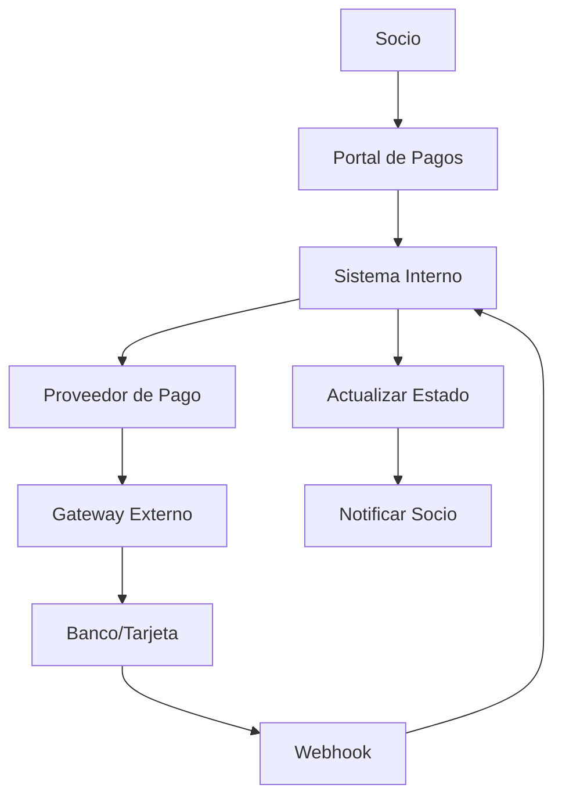

# 💰 06. Pagos y Facturación

Sistema financiero completo con proveedores de pago y facturación automatizada.

## 📋 **Orden de Lectura Recomendado**

### 1. **sistema-proveedores-pago.md** 💳
- **¿Qué es?** Integración con gateways de pago externos
- **¿Para quién?** Administradores financieros y desarrolladores
- **¿Cuándo usar?** Para configurar métodos de pago
- **Contenido clave:**
  - MercadoPago, PayPal, Stripe
  - Configuración segura de credenciales
  - Procesamiento de pagos
  - Webhooks y notificaciones

### 2. **sistema-suscripciones.md** 🔄
- **¿Qué es?** Facturación automática y gestión comercial
- **¿Para quién?** Gerentes comerciales y administradores
- **¿Cuándo usar?** Para configurar facturación recurrente
- **Contenido clave:**
  - Suscripciones automáticas
  - Comisiones y negociación
  - Facturación automática
  - Gestión de cobros

---

## 🎯 **Arquitectura Financiera**

### **Flujo Completo de Pagos**


### **Componentes del Sistema**
- 🏦 **Proveedores de Pago**: MercadoPago, PayPal, Stripe
- 💰 **Facturación**: Generación automática mensual
- 🔄 **Suscripciones**: Cobros recurrentes
- 📊 **Comisiones**: Negociación y gestión
- 📧 **Notificaciones**: Estados de pago

---

## 💳 **Proveedores de Pago**

### **Configuración de MercadoPago**
```http
POST /proveedores-pago-cooperativas
{
  "proveedorPagoId": "mercadopago-uuid",
  "configuracion": {
    "accessToken": "APP_USR_encrypted_token",
    "publicKey": "APP_USR_public_key",
    "clientId": "client_id",
    "clientSecret": "encrypted_secret"
  },
  "esPrincipal": true,
  "activo": true
}
```

### **Procesar Pago**
```http
POST /pagos/procesar
{
  "facturaId": "uuid-factura",
  "monto": 1500.50,
  "metodoPago": "tarjeta_credito",
  "proveedorPago": "mercadopago",
  "datosPago": {
    "token": "card_token_from_frontend",
    "cuotas": 1
  }
}
```

### **Webhook de Confirmación**
```http
POST /webhooks/mercadopago
{
  "action": "payment.updated",
  "api_version": "v1",
  "data": {
    "id": "payment_id"
  },
  "date_created": "2024-01-15T10:30:00Z",
  "id": "webhook_id",
  "live_mode": true,
  "type": "payment",
  "user_id": "user_id"
}
```

---

## 🔄 **Sistema de Suscripciones**

### **Configuración de Suscripción**
```http
POST /suscripciones/configuracion
{
  "planNombre": "Plan Básico",
  "montoMensual": 5000.00,
  "porcentajeComision": 2.5,
  "diaCorte": 1,
  "activa": true,
  "configuracionDatosBancarios": {
    "banco": "Banco Nación",
    "numeroCuenta": "1234567890",
    "cbu": "0110123456789012345678",
    "alias": "cooperativa.pagos"
  }
}
```

### **Facturación Automática**
```typescript
// Cron job que se ejecuta mensualmente
@Cron('0 0 1 * *') // Día 1 de cada mes
async generarFacturasMensuales() {
  const suscripciones = await this.getSuscripcionesActivas();
  
  for (const suscripcion of suscripciones) {
    await this.generarFactura({
      configuracionId: suscripcion.id,
      mes: new Date().getMonth() + 1,
      anio: new Date().getFullYear(),
      montoBase: suscripcion.montoMensual,
      comision: suscripcion.porcentajeComision
    });
  }
}
```

### **Gestión de Comisiones**
```http
POST /suscripciones/solicitar-cambio-comision
{
  "configuracionId": "uuid-config",
  "porcentajeComisionSolicitado": 2.0,
  "justificacion": "Volumen de transacciones aumentó significativamente",
  "fechaPropuestaImplementacion": "2024-02-01"
}
```

---

## 📊 **Casos de Uso Financieros**

### **💳 Para Socios (Pagos)**

#### **Ver Facturas Pendientes**
```http
GET /socios/facturas?estado=PENDIENTE
```

#### **Realizar Pago Online**
```http
POST /socios/pagar-factura
{
  "facturaId": "uuid-factura",
  "metodoPago": "mercadopago",
  "tipoTarjeta": "credito"
}
```

#### **Historial de Pagos**
```http
GET /socios/pagos?desde=2024-01-01&hasta=2024-01-31
```

### **👨‍💼 Para Administradores**

#### **Dashboard Financiero**
```http
GET /finanzas/dashboard?mes=1&anio=2024
```

#### **Reconciliación de Pagos**
```http
GET /pagos/reconciliar?fecha=2024-01-15&proveedor=mercadopago
```

#### **Reportes de Cobranza**
```http
GET /reportes/cobranza?periodo=2024-01&formato=excel
```

---

## 🔍 **Funcionalidades Avanzadas**

### **Multi-Proveedor**
- 💳 **Múltiples Gateways**: MercadoPago, PayPal, Stripe
- 🔄 **Failover Automático**: Si un proveedor falla
- 💰 **Optimización de Costos**: Ruteo por comisiones
- 📊 **Comparación**: Estadísticas por proveedor

### **Seguridad Financiera**
- 🔐 **Encriptación**: Credenciales encriptadas AES-256
- 🔒 **PCI Compliance**: Estándares de seguridad
- 📝 **Auditoría**: Logs de todas las transacciones
- ⚠️ **Detección de Fraude**: Patrones sospechosos

### **Automatización Inteligente**
- 🤖 **Facturación Automática**: Sin intervención manual
- 📧 **Notificaciones**: Estados de pago y vencimientos
- 💰 **Cálculo de Comisiones**: Automático con negociación
- 📊 **Reportes**: Generación automática

---

## 📱 **Integración Frontend**

### **Widget de Pago (React)**
```typescript
import { MercadoPagoWidget } from '@cooperativa/pagos';

function PagarFactura({ factura }) {
  return (
    <MercadoPagoWidget
      facturaId={factura.id}
      monto={factura.montoTotal}
      onSuccess={(pago) => {
        // Pago exitoso
        router.push('/pagos/exitoso');
      }}
      onError={(error) => {
        // Error en el pago
        showNotification(error.message);
      }}
    />
  );
}
```

### **Estados de Pago**
- ⏳ **PENDIENTE** - Iniciado pero no completado
- ✅ **APROBADO** - Pago exitoso
- ❌ **RECHAZADO** - Tarjeta rechazada
- 🔄 **EN_PROCESO** - Procesando pago
- ⚠️ **CANCELADO** - Cancelado por el usuario

---

## 📊 **Reportes y Analytics**

### **Métricas Clave**
```typescript
interface MetricasFinancieras {
  facturacionMensual: number;
  tasaCobranza: number;          // % de facturas cobradas
  tiempoPromedioCobro: number;   // días
  comisionesGeneradas: number;
  pagosRechazados: number;
  proveedorMasUsado: string;
}
```

### **Reportes Automáticos**
- 📊 **Dashboard Ejecutivo**: Métricas en tiempo real
- 💰 **Estado de Cobranza**: Por cooperativa
- 📈 **Tendencias**: Comparativos mensuales
- 🔍 **Análisis de Rechazo**: Causas de fallos

---

## ⚠️ **Configuraciones Críticas**

### **Seguridad**
- 🔐 **Secrets**: Nunca en código fuente
- 🔒 **HTTPS**: Obligatorio en producción
- 📝 **Logs**: Auditables pero sin datos sensibles
- 🔄 **Rotación**: Credenciales periódicamente

### **Compliance**
- 💳 **PCI DSS**: Estándares de tarjetas
- 📋 **AFIP**: Integración con facturación fiscal
- 🏦 **BCRA**: Normativas bancarias argentinas
- 📊 **Reportes**: Obligatorios para reguladores

---

## 🚀 **Próximo Paso**

Con el sistema financiero funcionando:
👉 **07-onboarding/** para automatizar la incorporación de cooperativas.

---

*¡El dinero es el motor de la cooperativa!* 💰