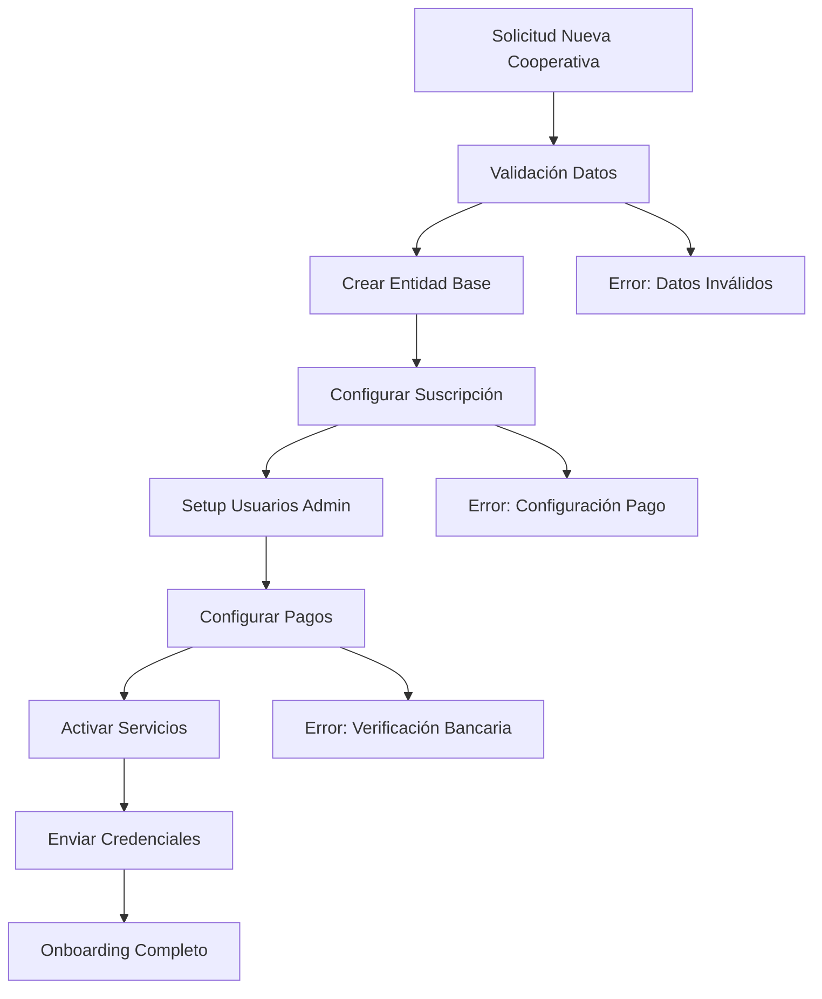

# 🚀 07. Onboarding y Configuración

Procesos automatizados para incorporar nuevas cooperativas al sistema.

## 📋 **Orden de Lectura Recomendado**

### 1. **bootstrap-cooperativa.md** 🏗️
- **¿Qué es?** Creación inicial automatizada de cooperativas
- **¿Para quién?** Super admins y consultores
- **¿Cuándo usar?** Al dar de alta una nueva cooperativa
- **Contenido clave:**
  - Datos básicos de la cooperativa
  - Configuración de suscripción
  - Usuarios administradores iniciales
  - Datos bancarios y fiscales

---

## 🎯 **Arquitectura de Onboarding**

### **Flujo Completo de Incorporación**


### **Componentes del Sistema**
- 🏗️ **Bootstrap**: Creación automatizada
- 👥 **Gestión de Usuarios**: Admins iniciales  
- 💳 **Configuración Financiera**: Suscripciones y pagos
- 📧 **Comunicaciones**: Emails de bienvenida
- ✅ **Verificaciones**: Validaciones automáticas

---

## 🏗️ **Bootstrap de Cooperativa**

### **Crear Nueva Cooperativa**
```http
POST /cooperativas/bootstrap
{
  "datosCooperativa": {
    "nombre": "Cooperativa San Martín",
    "cuit": "30-12345678-9",
    "direccion": {
      "calle": "San Martín 1234",
      "ciudad": "Buenos Aires",
      "provincia": "Buenos Aires",
      "codigoPostal": "1234"
    },
    "telefono": "+54 11 4567-8900",
    "email": "admin@cooperativa-sanmartin.coop"
  },
  "configuracionSuscripcion": {
    "planSeleccionado": "basico",
    "montoMensual": 5000.00,
    "diaCorte": 1,
    "configuracionDatosBancarios": {
      "banco": "Banco Nación",
      "numeroCuenta": "1234567890",
      "cbu": "0110123456789012345678",
      "alias": "sanmartin.coop"
    }
  },
  "usuarioAdministrador": {
    "persona": {
      "nombre": "Juan Carlos",
      "apellido": "Pérez",
      "email": "jperez@cooperativa-sanmartin.coop",
      "telefono": "+54 11 9876-5432",
      "documento": {
        "tipo": "DNI",
        "numero": "12345678"
      }
    },
    "credenciales": {
      "email": "jperez@cooperativa-sanmartin.coop",
      "passwordTemporal": true
    }
  }
}
```

### **Respuesta de Bootstrap Exitoso**
```json
{
  "success": true,
  "cooperativa": {
    "id": "uuid-cooperativa",
    "nombre": "Cooperativa San Martín",
    "estado": "ACTIVA",
    "fechaCreacion": "2024-01-15T10:30:00Z"
  },
  "suscripcion": {
    "id": "uuid-suscripcion",
    "plan": "basico",
    "estado": "ACTIVA",
    "proximaFacturacion": "2024-02-01"
  },
  "administrador": {
    "id": "uuid-usuario",
    "email": "jperez@cooperativa-sanmartin.coop",
    "passwordTemporal": "temp_pass_2024_ABC123",
    "debeActualizarPassword": true
  },
  "credencialesAcceso": {
    "urlAdmin": "https://admin.cooperativas.com/cooperativas/uuid-cooperativa",
    "emailEnviado": true,
    "validoHasta": "2024-01-22T10:30:00Z"
  }
}
```

---

## 👥 **Gestión de Usuarios Iniciales**

### **Crear Administrador Principal**
```typescript
async crearAdministradorPrincipal(cooperativaId: string, datosPersona: any) {
  // 1. Crear la persona
  const persona = await this.personasService.create({
    ...datosPersona,
    cooperativaId
  });

  // 2. Crear el usuario
  const usuario = await this.usuariosService.create({
    email: datosPersona.email,
    password: this.generarPasswordTemporal(),
    personaId: persona.id,
    cooperativaId,
    activo: true,
    debeActualizarPassword: true
  });

  // 3. Asignar rol de administrador
  await this.usuarioRolesService.asignarRol({
    usuarioId: usuario.id,
    rolId: await this.getRolAdministrador(),
    cooperativaId
  });

  // 4. Enviar email de bienvenida
  await this.emailService.enviarBienvenidaAdmin({
    email: usuario.email,
    passwordTemporal: usuario.password,
    urlAcceso: this.generarUrlAcceso(cooperativaId)
  });

  return usuario;
}
```

### **Configurar Equipos Base**
```typescript
async configurarEquiposBase(cooperativaId: string) {
  const equiposBase = [
    { nombre: 'Administradores', descripcion: 'Administradores del sistema' },
    { nombre: 'Operadores', descripcion: 'Operadores diarios' },
    { nombre: 'Socios', descripcion: 'Socios de la cooperativa' }
  ];

  for (const equipo of equiposBase) {
    await this.equiposService.create({
      ...equipo,
      cooperativaId,
      esAutomatico: true
    });
  }
}
```

---

## 💳 **Configuración Financiera**

### **Setup de Suscripción**
```typescript
async configurarSuscripcion(cooperativaId: string, config: ConfigSuscripcion) {
  // 1. Validar datos bancarios
  const validacionBancaria = await this.validarDatosBancarios(
    config.configuracionDatosBancarios
  );
  
  if (!validacionBancaria.valida) {
    throw new Error(`Datos bancarios inválidos: ${validacionBancaria.errores}`);
  }

  // 2. Crear configuración de suscripción
  const suscripcion = await this.suscripcionesService.create({
    cooperativaId,
    planNombre: config.planSeleccionado,
    montoMensual: config.montoMensual,
    diaCorte: config.diaCorte,
    configuracionDatosBancarios: config.configuracionDatosBancarios,
    activa: true,
    fechaInicio: new Date(),
    proximaFacturacion: this.calcularProximaFacturacion(config.diaCorte)
  });

  // 3. Programar primera facturación
  await this.programarPrimeraFacturacion(suscripcion.id);

  return suscripcion;
}
```

### **Validación de Datos Bancarios**
```typescript
async validarDatosBancarios(datos: DatosBancarios): Promise<ValidacionResult> {
  const validaciones = [
    this.validarCBU(datos.cbu),
    this.validarNumeroCuenta(datos.numeroCuenta),
    this.validarBanco(datos.banco),
    await this.validarAliasDisponible(datos.alias)
  ];

  const errores = validaciones
    .filter(v => !v.valida)
    .map(v => v.error);

  return {
    valida: errores.length === 0,
    errores
  };
}
```

---

## 📧 **Comunicaciones Automáticas**

### **Email de Bienvenida**
```typescript
class EmailBienvenidaTemplate {
  constructor(private data: BienvenidaData) {}

  generateHTML(): string {
    return `
      <div style="max-width: 600px; margin: 0 auto; font-family: Arial, sans-serif;">
        <header style="background: #2563eb; color: white; padding: 20px; text-align: center;">
          <h1>¡Bienvenido a CoopService!</h1>
        </header>
        
        <main style="padding: 30px;">
          <h2>Hola ${this.data.nombreAdmin},</h2>
          
          <p>Tu cooperativa <strong>${this.data.nombreCooperativa}</strong> ha sido configurada exitosamente.</p>
          
          <div style="background: #f3f4f6; padding: 20px; border-radius: 8px; margin: 20px 0;">
            <h3>📋 Datos de Acceso</h3>
            <p><strong>URL:</strong> <a href="${this.data.urlAcceso}">${this.data.urlAcceso}</a></p>
            <p><strong>Usuario:</strong> ${this.data.email}</p>
            <p><strong>Contraseña temporal:</strong> <code>${this.data.passwordTemporal}</code></p>
            <p><em>⚠️ Deberás cambiar esta contraseña en tu primer acceso</em></p>
          </div>
          
          <div style="background: #ecfdf5; padding: 20px; border-radius: 8px; margin: 20px 0;">
            <h3>🚀 Próximos Pasos</h3>
            <ol>
              <li>Accede al sistema con las credenciales proporcionadas</li>
              <li>Actualiza tu contraseña</li>
              <li>Completa la configuración de tu perfil</li>
              <li>Invita a otros administradores</li>
              <li>Comienza a cargar socios</li>
            </ol>
          </div>
          
          <div style="background: #fef3c7; padding: 20px; border-radius: 8px; margin: 20px 0;">
            <h3>💰 Información de Facturación</h3>
            <p><strong>Plan:</strong> ${this.data.plan}</p>
            <p><strong>Monto mensual:</strong> $${this.data.montoMensual}</p>
            <p><strong>Próxima facturación:</strong> ${this.data.proximaFacturacion}</p>
          </div>
        </main>
        
        <footer style="background: #f9fafb; padding: 20px; text-align: center; color: #6b7280;">
          <p>Si tienes alguna consulta, contáctanos en <a href="mailto:soporte@cooperativas.com">soporte@cooperativas.com</a></p>
          <p>© 2024 CoopService. Todos los derechos reservados.</p>
        </footer>
      </div>
    `;
  }
}
```

### **Notificaciones de Estado**
```typescript
@Injectable()
export class OnboardingNotificationsService {
  async notificarEstadoOnboarding(cooperativaId: string, estado: EstadoOnboarding) {
    const notificaciones = {
      'INICIADO': this.enviarNotificacionInicio,
      'VALIDANDO_DATOS': this.enviarNotificacionValidacion,
      'CONFIGURANDO_SERVICIOS': this.enviarNotificacionConfiguracion,
      'COMPLETADO': this.enviarNotificacionCompletado,
      'ERROR': this.enviarNotificacionError
    };

    await notificaciones[estado](cooperativaId);
  }

  private async enviarNotificacionCompletado(cooperativaId: string) {
    const cooperativa = await this.cooperativasService.findOne(cooperativaId);
    const admin = await this.getAdministradorPrincipal(cooperativaId);

    await this.emailService.send({
      to: admin.email,
      subject: `🎉 ${cooperativa.nombre} - Configuración Completada`,
      template: 'onboarding-completado',
      data: { cooperativa, admin }
    });
  }
}
```

---

## ✅ **Validaciones y Verificaciones**

### **Checklist de Onboarding**
```typescript
interface OnboardingChecklist {
  datosBasicos: boolean;          // CUIT, nombre, dirección
  datosBancarios: boolean;        // CBU, cuenta, banco
  administrador: boolean;         // Usuario admin creado
  suscripcion: boolean;           // Plan configurado
  serviciosActivos: boolean;      // Servicios habilitados
  emailEnviado: boolean;          // Credenciales enviadas
  primeraFactura: boolean;        // Facturación programada
}

async validarOnboardingCompleto(cooperativaId: string): Promise<OnboardingChecklist> {
  return {
    datosBasicos: await this.validarDatosBasicos(cooperativaId),
    datosBancarios: await this.validarDatosBancarios(cooperativaId),
    administrador: await this.validarAdministrador(cooperativaId),
    suscripcion: await this.validarSuscripcion(cooperativaId),
    serviciosActivos: await this.validarServicios(cooperativaId),
    emailEnviado: await this.validarEmailEnviado(cooperativaId),
    primeraFactura: await this.validarFacturacionProgramada(cooperativaId)
  };
}
```

### **Rollback en Caso de Error**
```typescript
async rollbackOnboarding(cooperativaId: string, razon: string) {
  try {
    // 1. Desactivar servicios
    await this.desactivarServicios(cooperativaId);
    
    // 2. Cancelar suscripción
    await this.suscripcionesService.cancelar(cooperativaId);
    
    // 3. Desactivar usuarios
    await this.desactivarUsuarios(cooperativaId);
    
    // 4. Marcar cooperativa como inactiva
    await this.cooperativasService.update(cooperativaId, { 
      estado: 'INACTIVA',
      fechaDesactivacion: new Date(),
      motivoDesactivacion: razon
    });
    
    // 5. Notificar error
    await this.notificarErrorOnboarding(cooperativaId, razon);
    
  } catch (error) {
    // Log crítico - problema en rollback
    this.logger.error(`Error en rollback para cooperativa ${cooperativaId}:`, error);
  }
}
```

---

## 🔧 **Configuraciones por Defecto**

### **Roles Base**
```typescript
const ROLES_BASE = [
  {
    nombre: 'Super Administrador',
    codigo: 'SUPER_ADMIN',
    permisos: ['*'], // Todos los permisos
    esAdmin: true
  },
  {
    nombre: 'Administrador',
    codigo: 'ADMIN',
    permisos: [
      'socios.crear', 'socios.editar', 'socios.listar',
      'usuarios.crear', 'usuarios.editar',
      'inmuebles.gestionar', 'pagos.ver'
    ],
    esAdmin: true
  },
  {
    nombre: 'Operador',
    codigo: 'OPERADOR',
    permisos: [
      'socios.listar', 'socios.editar',
      'inmuebles.ver', 'pagos.procesar'
    ],
    esAdmin: false
  },
  {
    nombre: 'Socio',
    codigo: 'SOCIO',
    permisos: [
      'perfil.ver', 'perfil.editar',
      'facturas.ver', 'pagos.realizar'
    ],
    esAdmin: false
  }
];
```

### **Configuraciones Iniciales**
```typescript
const CONFIG_INICIAL = {
  // Configuración de emails
  email: {
    remitente: 'noreply@cooperativas.com',
    tiempoExpiracionToken: 7 * 24 * 60 * 60 * 1000, // 7 días
    templateBienvenida: 'onboarding-bienvenida'
  },
  
  // Configuración de seguridad
  seguridad: {
    longitudPasswordTemporal: 12,
    requiereActualizacionPassword: true,
    tiempoSesion: 8 * 60 * 60 * 1000 // 8 horas
  },
  
  // Configuración de facturación
  facturacion: {
    diaCorteDefault: 1,
    monedaDefault: 'ARS',
    porcentajeComisionDefault: 3.0
  }
};
```

---

## 📊 **Monitoreo de Onboarding**

### **Métricas de Seguimiento**
```typescript
interface MetricasOnboarding {
  onboardingsIniciados: number;
  onboardingsCompletados: number;
  onboardingsFallidos: number;
  tiempoPromedioCompletado: number; // minutos
  tasaExito: number; // porcentaje
  erroresComunes: Array<{
    error: string;
    frecuencia: number;
  }>;
}

// Dashboard de onboarding
@Get('onboarding/metricas')
async getMetricasOnboarding(@Query() filtros: FiltrosMetricas) {
  return this.onboardingService.getMetricas(filtros);
}
```

### **Alertas Automáticas**
```typescript
// Alerta si un onboarding tarda más de 1 hora
@Cron('*/15 * * * *') // Cada 15 minutos
async verificarOnboardingsPendientes() {
  const onboardingsPendientes = await this.getOnboardingsPendientes();
  
  for (const onboarding of onboardingsPendientes) {
    const tiempoTranscurrido = Date.now() - onboarding.fechaInicio.getTime();
    
    if (tiempoTranscurrido > 60 * 60 * 1000) { // 1 hora
      await this.alertasService.enviarAlerta({
        tipo: 'ONBOARDING_DEMORADO',
        cooperativaId: onboarding.cooperativaId,
        mensaje: `Onboarding demorado más de 1 hora`,
        prioridad: 'ALTA'
      });
    }
  }
}
```

---

## 🚀 **Próximo Paso**

Con el onboarding automatizado:
👉 **08-arquitectura-avanzada/** para funcionalidades complejas del sistema.

---

*¡La primera impresión es la que cuenta!* ✨