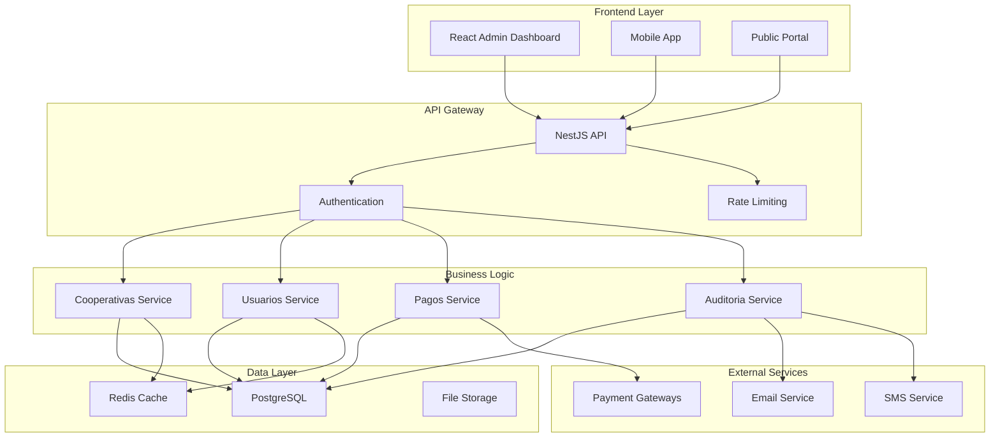

# 🏗️ 08. Arquitectura Avanzada

Componentes complejos y patrones arquitectónicos para escalabilidad empresarial.

## 📋 **Orden de Lectura Recomendado**

### 1. **logs-auditoria.md** 📊
- **¿Qué es?** Sistema completo de logging y auditoría
- **¿Para quién?** DevOps, auditores y administradores de sistemas
- **¿Cuándo usar?** Para debugging, compliance y monitoreo
- **Contenido clave:**
  - Logs estructurados con Winston
  - Trazabilidad de operaciones críticas
  - Auditoría de cambios
  - Métricas y monitoreo

### 2. **prisma-module.md** 🗄️
- **¿Qué es?** Arquitectura de base de datos con Prisma ORM
- **¿Para quién?** Desarrolladores backend y DBAs
- **¿Cuándo usar?** Para entender el modelo de datos
- **Contenido clave:**
  - Configuración multi-tenant
  - Modelos de datos complejos
  - Migraciones automáticas
  - Optimizaciones de performance

---

## 🎯 **Arquitectura del Sistema**

### **Arquitectura de Alto Nivel**


### **Patrones Arquitectónicos**
- 🏗️ **Multi-Tenancy**: Aislamiento por cooperativa
- 🔄 **CQRS**: Separación de comandos y consultas
- 📝 **Event Sourcing**: Historial inmutable de eventos
- 🧩 **Microservicios**: Servicios independientes
- 🔒 **Circuit Breaker**: Tolerancia a fallos
- 📊 **Observabilidad**: Logs, métricas y trazas

---

## 📊 **Sistema de Logging y Auditoría**

### **Configuración de Winston**
```typescript
import { WinstonModule } from 'nest-winston';
import * as winston from 'winston';

const loggerConfig = {
  level: process.env.LOG_LEVEL || 'info',
  format: winston.format.combine(
    winston.format.timestamp(),
    winston.format.errors({ stack: true }),
    winston.format.json(),
    winston.format.metadata()
  ),
  defaultMeta: {
    service: 'coop-service-backend',
    version: process.env.APP_VERSION || '1.0.0'
  },
  transports: [
    new winston.transports.Console({
      format: winston.format.combine(
        winston.format.colorize(),
        winston.format.simple()
      )
    }),
    new winston.transports.File({
      filename: 'logs/error.log',
      level: 'error',
      maxsize: 5242880, // 5MB
      maxFiles: 5
    }),
    new winston.transports.File({
      filename: 'logs/combined.log',
      maxsize: 5242880,
      maxFiles: 10
    })
  ]
};
```

### **Interceptor de Auditoría**
```typescript
@Injectable()
export class AuditInterceptor implements NestInterceptor {
  constructor(
    private readonly auditService: AuditService,
    private readonly logger: Logger
  ) {}

  intercept(context: ExecutionContext, next: CallHandler): Observable<any> {
    const request = context.switchToHttp().getRequest();
    const { method, url, body, user } = request;
    
    const auditLog = {
      usuarioId: user?.sub,
      cooperativaId: user?.cooperativaId,
      accion: `${method} ${url}`,
      ip: request.ip,
      userAgent: request.get('User-Agent'),
      timestamp: new Date(),
      datos: this.sanitizeBody(body)
    };

    return next.handle().pipe(
      tap((response) => {
        // Log operación exitosa
        this.auditService.logOperacion({
          ...auditLog,
          resultado: 'EXITOSO',
          response: this.sanitizeResponse(response)
        });
      }),
      catchError((error) => {
        // Log operación fallida
        this.auditService.logOperacion({
          ...auditLog,
          resultado: 'ERROR',
          error: error.message,
          stack: error.stack
        });
        throw error;
      })
    );
  }

  private sanitizeBody(body: any): any {
    if (!body) return undefined;
    
    const sensitiveFields = ['password', 'token', 'secret', 'key'];
    const sanitized = { ...body };
    
    sensitiveFields.forEach(field => {
      if (sanitized[field]) {
        sanitized[field] = '***MASKED***';
      }
    });
    
    return sanitized;
  }
}
```

### **Servicio de Auditoría**
```typescript
@Injectable()
export class AuditService {
  constructor(
    private readonly prisma: PrismaService,
    private readonly logger: Logger
  ) {}

  async logOperacion(datos: AuditLogData): Promise<void> {
    try {
      await this.prisma.auditLog.create({
        data: {
          usuarioId: datos.usuarioId,
          cooperativaId: datos.cooperativaId,
          accion: datos.accion,
          entidad: datos.entidad,
          entidadId: datos.entidadId,
          datosAnteriores: datos.datosAnteriores,
          datosNuevos: datos.datosNuevos,
          ip: datos.ip,
          userAgent: datos.userAgent,
          resultado: datos.resultado,
          tiempoEjecucion: datos.tiempoEjecucion,
          metadata: datos.metadata
        }
      });
    } catch (error) {
      this.logger.error('Error al guardar log de auditoría:', error);
    }
  }

  async buscarAuditoria(filtros: AuditoriaFilters): Promise<AuditLog[]> {
    return this.prisma.auditLog.findMany({
      where: {
        cooperativaId: filtros.cooperativaId,
        usuarioId: filtros.usuarioId,
        entidad: filtros.entidad,
        accion: { contains: filtros.accion },
        timestamp: {
          gte: filtros.fechaDesde,
          lte: filtros.fechaHasta
        }
      },
      include: {
        usuario: {
          include: {
            persona: {
              select: { nombre: true, apellido: true }
            }
          }
        }
      },
      orderBy: { timestamp: 'desc' },
      take: filtros.limit || 100
    });
  }
}
```

---

## 🗄️ **Arquitectura de Base de Datos**

### **Configuración Multi-Tenant**
```typescript
// prisma.service.ts
@Injectable()
export class PrismaService extends PrismaClient {
  constructor() {
    super({
      log: ['query', 'info', 'warn', 'error'],
      datasources: {
        db: {
          url: process.env.DATABASE_URL
        }
      }
    });
  }

  async onModuleInit() {
    await this.$connect();
    
    // Middleware para filtrado automático por cooperativa
    this.$use(async (params, next) => {
      // Modelos que requieren filtrado por cooperativa
      const modelsWithCooperativa = [
        'Usuario', 'Persona', 'Inmueble', 'Factura', 
        'Pago', 'Equipo', 'UsuarioRol'
      ];

      if (modelsWithCooperativa.includes(params.model)) {
        if (params.action === 'findMany' || params.action === 'findFirst') {
          // Agregar filtro de cooperativa si no existe
          if (!params.args.where?.cooperativaId) {
            const cooperativaId = this.getCurrentCooperativaId();
            if (cooperativaId) {
              params.args.where = {
                ...params.args.where,
                cooperativaId
              };
            }
          }
        }
      }

      return next(params);
    });
  }

  private getCurrentCooperativaId(): string | null {
    // Obtener cooperativaId del contexto actual
    // Esto se puede implementar usando cls-hooked o similar
    return RequestContext.getCurrentCooperativaId();
  }
}
```

### **Optimizaciones de Performance**
```typescript
// database-optimization.service.ts
@Injectable()
export class DatabaseOptimizationService {
  constructor(private readonly prisma: PrismaService) {}

  // Índices compuestos para consultas frecuentes
  async createOptimalIndexes() {
    await this.prisma.$executeRaw`
      -- Índice compuesto para búsquedas de usuarios por cooperativa
      CREATE INDEX CONCURRENTLY IF NOT EXISTS idx_usuarios_cooperativa_email 
      ON "Usuario" (cooperativa_id, email);
      
      -- Índice para auditoría por fecha y cooperativa
      CREATE INDEX CONCURRENTLY IF NOT EXISTS idx_audit_cooperativa_timestamp 
      ON "AuditLog" (cooperativa_id, timestamp DESC);
      
      -- Índice para facturas por estado y cooperativa
      CREATE INDEX CONCURRENTLY IF NOT EXISTS idx_facturas_cooperativa_estado 
      ON "Factura" (cooperativa_id, estado, fecha_vencimiento);
    `;
  }

  // Consultas optimizadas con paginación
  async findUsuariosPaginados(
    cooperativaId: string, 
    pagination: PaginationDto
  ): Promise<PaginatedResult<Usuario>> {
    const [total, usuarios] = await Promise.all([
      this.prisma.usuario.count({
        where: { cooperativaId }
      }),
      this.prisma.usuario.findMany({
        where: { cooperativaId },
        include: {
          persona: {
            select: { nombre: true, apellido: true, email: true }
          },
          usuarioRoles: {
            include: {
              rol: { select: { nombre: true } }
            }
          }
        },
        skip: pagination.offset,
        take: pagination.limit,
        orderBy: { fechaCreacion: 'desc' }
      })
    ]);

    return {
      data: usuarios,
      total,
      page: pagination.page,
      totalPages: Math.ceil(total / pagination.limit)
    };
  }
}
```

---

## 🔄 **Event Sourcing y CQRS**

### **Event Store**
```typescript
interface DomainEvent {
  id: string;
  aggregateId: string;
  aggregateType: string;
  eventType: string;
  eventData: any;
  metadata: any;
  timestamp: Date;
  version: number;
}

@Injectable()
export class EventStore {
  constructor(private readonly prisma: PrismaService) {}

  async saveEvent(event: DomainEvent): Promise<void> {
    await this.prisma.evento.create({
      data: {
        id: event.id,
        aggregateId: event.aggregateId,
        aggregateType: event.aggregateType,
        eventType: event.eventType,
        eventData: event.eventData,
        metadata: event.metadata,
        version: event.version
      }
    });
  }

  async getEvents(aggregateId: string, fromVersion?: number): Promise<DomainEvent[]> {
    return this.prisma.evento.findMany({
      where: {
        aggregateId,
        version: fromVersion ? { gte: fromVersion } : undefined
      },
      orderBy: { version: 'asc' }
    });
  }
}
```

### **Command Handler**
```typescript
@CommandHandler(CrearUsuarioCommand)
export class CrearUsuarioHandler implements ICommandHandler<CrearUsuarioCommand> {
  constructor(
    private readonly eventStore: EventStore,
    private readonly eventBus: EventBus
  ) {}

  async execute(command: CrearUsuarioCommand): Promise<void> {
    // 1. Validar comando
    await this.validarComando(command);

    // 2. Crear evento
    const evento = new UsuarioCreatedEvent({
      usuarioId: command.usuarioId,
      email: command.email,
      cooperativaId: command.cooperativaId,
      personaId: command.personaId,
      timestamp: new Date()
    });

    // 3. Guardar evento
    await this.eventStore.saveEvent(evento);

    // 4. Publicar evento
    this.eventBus.publish(evento);
  }

  private async validarComando(command: CrearUsuarioCommand): Promise<void> {
    // Validaciones de negocio
    if (await this.emailYaExiste(command.email, command.cooperativaId)) {
      throw new Error('Email ya existe en esta cooperativa');
    }
  }
}
```

---

## 🔒 **Seguridad Avanzada**

### **Rate Limiting**
```typescript
@Injectable()
export class CustomRateLimitGuard implements CanActivate {
  constructor(private readonly redis: Redis) {}

  async canActivate(context: ExecutionContext): Promise<boolean> {
    const request = context.switchToHttp().getRequest();
    const key = this.generateKey(request);
    
    const current = await this.redis.incr(key);
    
    if (current === 1) {
      await this.redis.expire(key, 60); // 1 minuto
    }
    
    const limit = this.getLimit(request);
    
    if (current > limit) {
      throw new ThrottlerException(
        `Rate limit exceeded. Max ${limit} requests per minute.`
      );
    }
    
    return true;
  }

  private generateKey(request: any): string {
    const userId = request.user?.sub || 'anonymous';
    const ip = request.ip;
    const endpoint = request.route.path;
    
    return `rate_limit:${userId}:${ip}:${endpoint}`;
  }

  private getLimit(request: any): number {
    // Límites diferentes según el endpoint
    const endpointLimits = {
      '/auth/login': 5,
      '/usuarios': 100,
      '/pagos/procesar': 10
    };
    
    return endpointLimits[request.route.path] || 60;
  }
}
```

### **Encriptación de Datos Sensibles**
```typescript
@Injectable()
export class EncryptionService {
  private readonly algorithm = 'aes-256-gcm';
  private readonly key = crypto.scryptSync(process.env.ENCRYPTION_KEY, 'salt', 32);

  encrypt(text: string): EncryptedData {
    const iv = crypto.randomBytes(16);
    const cipher = crypto.createCipher(this.algorithm, this.key, iv);
    
    let encrypted = cipher.update(text, 'utf8', 'hex');
    encrypted += cipher.final('hex');
    
    const authTag = cipher.getAuthTag();
    
    return {
      encrypted,
      iv: iv.toString('hex'),
      authTag: authTag.toString('hex')
    };
  }

  decrypt(encryptedData: EncryptedData): string {
    const decipher = crypto.createDecipher(
      this.algorithm, 
      this.key, 
      Buffer.from(encryptedData.iv, 'hex')
    );
    
    decipher.setAuthTag(Buffer.from(encryptedData.authTag, 'hex'));
    
    let decrypted = decipher.update(encryptedData.encrypted, 'hex', 'utf8');
    decrypted += decipher.final('utf8');
    
    return decrypted;
  }
}
```

---

## 📊 **Monitoreo y Observabilidad**

### **Health Checks**
```typescript
@Controller('health')
export class HealthController {
  constructor(
    private readonly health: HealthCheckService,
    private readonly prisma: PrismaIndicator,
    private readonly redis: RedisIndicator,
    private readonly disk: DiskHealthIndicator,
    private readonly memory: MemoryHealthIndicator
  ) {}

  @Get()
  @HealthCheck()
  check() {
    return this.health.check([
      () => this.prisma.pingCheck('database'),
      () => this.redis.checkHealth('redis'),
      () => this.disk.checkStorage('storage', { 
        path: '/', 
        thresholdPercent: 0.9 
      }),
      () => this.memory.checkHeap('memory_heap', 150 * 1024 * 1024),
      () => this.memory.checkRSS('memory_rss', 150 * 1024 * 1024)
    ]);
  }

  @Get('detailed')
  async detailedHealth() {
    const [dbStats, redisInfo, systemInfo] = await Promise.all([
      this.getDatabaseStats(),
      this.getRedisInfo(),
      this.getSystemInfo()
    ]);

    return {
      timestamp: new Date(),
      uptime: process.uptime(),
      database: dbStats,
      redis: redisInfo,
      system: systemInfo,
      version: process.env.APP_VERSION
    };
  }
}
```

### **Métricas con Prometheus**
```typescript
@Injectable()
export class MetricsService {
  private readonly httpRequestDuration = new prometheus.Histogram({
    name: 'http_request_duration_seconds',
    help: 'Duration of HTTP requests in seconds',
    labelNames: ['method', 'route', 'status_code'],
    buckets: [0.1, 0.3, 0.5, 0.7, 1, 3, 5, 7, 10]
  });

  private readonly activeUsers = new prometheus.Gauge({
    name: 'active_users_total',
    help: 'Number of active users',
    labelNames: ['cooperativa']
  });

  recordHttpRequest(method: string, route: string, statusCode: number, duration: number) {
    this.httpRequestDuration
      .labels(method, route, statusCode.toString())
      .observe(duration);
  }

  updateActiveUsers(cooperativaId: string, count: number) {
    this.activeUsers.labels(cooperativaId).set(count);
  }

  @Cron('*/30 * * * * *') // Cada 30 segundos
  async updateMetrics() {
    const cooperativas = await this.getCooperativasActivas();
    
    for (const cooperativa of cooperativas) {
      const activeCount = await this.getActiveUsersCount(cooperativa.id);
      this.updateActiveUsers(cooperativa.id, activeCount);
    }
  }
}
```

---

## 🧩 **Microservicios y Comunicación**

### **Message Queue con Bull**
```typescript
@Processor('email-queue')
export class EmailProcessor {
  constructor(private readonly emailService: EmailService) {}

  @Process('send-email')
  async handleSendEmail(job: Job<EmailJobData>) {
    const { to, subject, template, data } = job.data;
    
    try {
      await this.emailService.sendTemplateEmail(to, subject, template, data);
      
      // Actualizar progreso
      job.progress(100);
      
      return { success: true, timestamp: new Date() };
    } catch (error) {
      throw new Error(`Failed to send email: ${error.message}`);
    }
  }

  @OnQueueActive()
  onActive(job: Job) {
    console.log(`Processing email job ${job.id} of type ${job.name}`);
  }

  @OnQueueCompleted()
  onComplete(job: Job, result: any) {
    console.log(`Email job ${job.id} completed successfully`);
  }

  @OnQueueFailed()
  onError(job: Job, error: any) {
    console.error(`Email job ${job.id} failed:`, error);
  }
}
```

### **Circuit Breaker Pattern**
```typescript
@Injectable()
export class PaymentGatewayService {
  private readonly circuitBreaker = new CircuitBreaker(
    this.processPayment.bind(this),
    {
      timeout: 10000,        // 10 segundos
      errorThresholdPercentage: 50,
      resetTimeout: 30000    // 30 segundos
    }
  );

  constructor(private readonly httpService: HttpService) {
    this.setupCircuitBreakerEvents();
  }

  async processPaymentWithCircuitBreaker(paymentData: PaymentData) {
    try {
      return await this.circuitBreaker.fire(paymentData);
    } catch (error) {
      if (error.name === 'OpenCircuitError') {
        // Circuit breaker abierto - usar servicio de fallback
        return this.processPaymentFallback(paymentData);
      }
      throw error;
    }
  }

  private async processPayment(paymentData: PaymentData) {
    const response = await this.httpService.post(
      '/payments/process',
      paymentData
    ).toPromise();
    
    return response.data;
  }

  private async processPaymentFallback(paymentData: PaymentData) {
    // Guardar pago para procesamiento posterior
    await this.queuePaymentForLaterProcessing(paymentData);
    
    return {
      status: 'QUEUED',
      message: 'Payment queued for later processing'
    };
  }
}
```

---

## 🚀 **Próximo Paso**

Con la arquitectura avanzada implementada:
👉 **99-migraciones/** para gestionar cambios y actualizaciones del sistema.

---

*¡La arquitectura sólida es la base del éxito!* 🏗️