# 🔄 99. Migraciones y Mantenimiento

Gestión de cambios, actualizaciones y mantenimiento del sistema en producción.

## 📋 **Orden de Lectura Recomendado**

### 1. **migration-multi-tenancy.md** 🏗️
- **¿Qué es?** Migración crítica de single-tenant a multi-tenant
- **¿Para quién?** DBAs, DevOps y desarrolladores senior
- **¿Cuándo usar?** Al implementar multi-tenancy en sistemas existentes
- **Contenido clave:**
  - Estrategia de migración de datos
  - Respaldo y rollback procedures
  - Testing exhaustivo pre-producción
  - Plan de comunicación con usuarios

---

## 🎯 **Estrategia de Migraciones**

### **Filosofía de Migraciones**

```mermaid
graph LR
    A[Desarrollo] --> B[Testing]
    B --> C[Staging]
    C --> D[Pre-Producción]
    D --> E[Producción]
    
    B --> F[Rollback Plan]
    C --> F
    D --> F
    E --> F
    
    F --> G[Recovery Procedures]
```


### **Tipos de Migraciones**
- 🔄 **Schema Changes**: Modificaciones de estructura
- 📊 **Data Migrations**: Transformación de datos existentes
- 🏗️ **Architecture Migrations**: Cambios arquitectónicos mayores
- 🔧 **Configuration Updates**: Cambios de configuración
- 🔒 **Security Patches**: Actualizaciones de seguridad

---

## 🏗️ **Migración Multi-Tenancy**

### **Análisis Pre-Migración**
```sql
-- Análisis de datos existentes
SELECT 
  'usuarios' as tabla,
  COUNT(*) as total_registros,
  COUNT(DISTINCT cooperativa_id) as cooperativas_distintas
FROM "Usuario"
UNION ALL
SELECT 
  'personas' as tabla,
  COUNT(*) as total_registros,
  COUNT(DISTINCT cooperativa_id) as cooperativas_distintas
FROM "Persona"
UNION ALL
SELECT 
  'inmuebles' as tabla,
  COUNT(*) as total_registros,
  COUNT(DISTINCT cooperativa_id) as cooperativas_distintas
FROM "Inmueble";

-- Verificar integridad referencial
SELECT 
  u.id as usuario_id,
  u.email,
  u.cooperativa_id as usuario_coop,
  p.cooperativa_id as persona_coop
FROM "Usuario" u
JOIN "Persona" p ON u.persona_id = p.id
WHERE u.cooperativa_id != p.cooperativa_id;
```

### **Plan de Migración Paso a Paso**

#### **Fase 1: Preparación (No Downtime)**
```sql
-- 1. Crear nuevas tablas
CREATE TABLE "UsuarioCooperativa" (
  id VARCHAR(36) PRIMARY KEY DEFAULT gen_random_uuid(),
  usuario_id VARCHAR(36) NOT NULL,
  cooperativa_id VARCHAR(36) NOT NULL,
  fecha_ingreso TIMESTAMP DEFAULT CURRENT_TIMESTAMP,
  activo BOOLEAN DEFAULT true,
  UNIQUE(usuario_id, cooperativa_id)
);

-- 2. Crear índices
CREATE INDEX idx_usuario_cooperativa_usuario ON "UsuarioCooperativa"(usuario_id);
CREATE INDEX idx_usuario_cooperativa_cooperativa ON "UsuarioCooperativa"(cooperativa_id);

-- 3. Crear tablas de respaldo
CREATE TABLE "Usuario_backup_20241015" AS SELECT * FROM "Usuario";
CREATE TABLE "UsuarioRol_backup_20241015" AS SELECT * FROM "UsuarioRol";
```

#### **Fase 2: Migración de Datos (Downtime Mínimo)**
```sql
-- 1. Poblar UsuarioCooperativa con datos existentes
INSERT INTO "UsuarioCooperativa" (usuario_id, cooperativa_id, fecha_ingreso, activo)
SELECT 
  id as usuario_id,
  cooperativa_id,
  fecha_creacion as fecha_ingreso,
  activo
FROM "Usuario"
WHERE cooperativa_id IS NOT NULL;

-- 2. Actualizar UsuarioRol para referenciar UsuarioCooperativa
ALTER TABLE "UsuarioRol" ADD COLUMN usuario_cooperativa_id VARCHAR(36);

UPDATE "UsuarioRol" ur
SET usuario_cooperativa_id = uc.id
FROM "UsuarioCooperativa" uc
JOIN "Usuario" u ON uc.usuario_id = u.id
WHERE ur.usuario_id = u.id 
  AND ur.cooperativa_id = uc.cooperativa_id;

-- 3. Verificar integridad
SELECT COUNT(*) FROM "UsuarioRol" WHERE usuario_cooperativa_id IS NULL;
```

#### **Fase 3: Limpieza (Post-Migración)**
```sql
-- 1. Eliminar columnas obsoletas
ALTER TABLE "Usuario" DROP COLUMN cooperativa_id;
ALTER TABLE "UsuarioRol" DROP COLUMN usuario_id;
ALTER TABLE "UsuarioRol" DROP COLUMN cooperativa_id;

-- 2. Agregar constraints
ALTER TABLE "UsuarioRol" 
ADD CONSTRAINT fk_usuario_rol_usuario_cooperativa 
FOREIGN KEY (usuario_cooperativa_id) 
REFERENCES "UsuarioCooperativa"(id);

-- 3. Actualizar índices
DROP INDEX IF EXISTS idx_usuario_cooperativa;
CREATE INDEX idx_usuario_rol_usuario_cooperativa ON "UsuarioRol"(usuario_cooperativa_id);
```

### **Scripts de Validación**
```typescript
// validation-script.ts
@Injectable()
export class MigrationValidationService {
  constructor(private prisma: PrismaService) {}

  async validateMultiTenancyMigration(): Promise<ValidationResult> {
    const validations = await Promise.all([
      this.validateUsuarioCooperativaIntegrity(),
      this.validateUsuarioRolReferences(),
      this.validateDataConsistency(),
      this.validatePerformance()
    ]);

    return {
      allValid: validations.every(v => v.valid),
      results: validations
    };
  }

  private async validateUsuarioCooperativaIntegrity(): Promise<ValidationCheck> {
    const orphanedRecords = await this.prisma.$queryRaw`
      SELECT COUNT(*) as count
      FROM "UsuarioCooperativa" uc
      LEFT JOIN "Usuario" u ON uc.usuario_id = u.id
      LEFT JOIN "Cooperativa" c ON uc.cooperativa_id = c.id
      WHERE u.id IS NULL OR c.id IS NULL
    `;

    return {
      name: 'UsuarioCooperativa Integrity',
      valid: orphanedRecords[0].count === 0,
      message: orphanedRecords[0].count === 0 
        ? 'All references valid' 
        : `Found ${orphanedRecords[0].count} orphaned records`
    };
  }

  private async validateUsuarioRolReferences(): Promise<ValidationCheck> {
    const invalidReferences = await this.prisma.$queryRaw`
      SELECT COUNT(*) as count
      FROM "UsuarioRol" ur
      LEFT JOIN "UsuarioCooperativa" uc ON ur.usuario_cooperativa_id = uc.id
      WHERE uc.id IS NULL
    `;

    return {
      name: 'UsuarioRol References',
      valid: invalidReferences[0].count === 0,
      message: invalidReferences[0].count === 0 
        ? 'All UsuarioRol references valid' 
        : `Found ${invalidReferences[0].count} invalid references`
    };
  }

  private async validateDataConsistency(): Promise<ValidationCheck> {
    const [beforeCount, afterCount] = await Promise.all([
      this.prisma.$queryRaw`SELECT COUNT(*) as count FROM "Usuario_backup_20241015"`,
      this.prisma.$queryRaw`
        SELECT COUNT(DISTINCT usuario_id) as count 
        FROM "UsuarioCooperativa" 
        WHERE activo = true
      `
    ]);

    const consistent = beforeCount[0].count === afterCount[0].count;

    return {
      name: 'Data Consistency',
      valid: consistent,
      message: consistent 
        ? `User count matches: ${beforeCount[0].count}` 
        : `Mismatch: before=${beforeCount[0].count}, after=${afterCount[0].count}`
    };
  }
}
```

---

## 🔄 **Gestión de Rollbacks**

### **Plan de Rollback Automático**
```typescript
@Injectable()
export class RollbackService {
  constructor(private prisma: PrismaService) {}

  async executeRollback(migrationId: string): Promise<RollbackResult> {
    const migration = await this.getMigrationDetails(migrationId);
    
    if (!migration.rollbackScript) {
      throw new Error('No rollback script available for this migration');
    }

    // 1. Crear backup pre-rollback
    await this.createPreRollbackBackup(migrationId);

    // 2. Ejecutar rollback
    try {
      await this.executeRollbackScript(migration.rollbackScript);
      
      // 3. Validar rollback
      const validation = await this.validateRollback(migrationId);
      
      if (!validation.success) {
        throw new Error(`Rollback validation failed: ${validation.errors}`);
      }

      // 4. Marcar como rolled back
      await this.markAsRolledBack(migrationId);

      return {
        success: true,
        timestamp: new Date(),
        migrationId,
        message: 'Rollback completed successfully'
      };

    } catch (error) {
      // 5. Log error y intentar recovery
      await this.logRollbackError(migrationId, error);
      throw error;
    }
  }

  private async executeRollbackScript(script: string): Promise<void> {
    const statements = script.split(';').filter(s => s.trim());
    
    for (const statement of statements) {
      await this.prisma.$executeRawUnsafe(statement);
    }
  }
}
```

### **Rollback para Multi-Tenancy**
```sql
-- rollback-multi-tenancy.sql

-- 1. Restaurar columna cooperativa_id en Usuario
ALTER TABLE "Usuario" ADD COLUMN cooperativa_id VARCHAR(36);

-- 2. Poblar con datos de UsuarioCooperativa
UPDATE "Usuario" u
SET cooperativa_id = uc.cooperativa_id
FROM "UsuarioCooperativa" uc
WHERE u.id = uc.usuario_id
  AND uc.activo = true;

-- 3. Restaurar UsuarioRol
ALTER TABLE "UsuarioRol" ADD COLUMN usuario_id VARCHAR(36);
ALTER TABLE "UsuarioRol" ADD COLUMN cooperativa_id VARCHAR(36);

UPDATE "UsuarioRol" ur
SET 
  usuario_id = uc.usuario_id,
  cooperativa_id = uc.cooperativa_id
FROM "UsuarioCooperativa" uc
WHERE ur.usuario_cooperativa_id = uc.id;

-- 4. Eliminar nuevas tablas
DROP TABLE "UsuarioCooperativa";
ALTER TABLE "UsuarioRol" DROP COLUMN usuario_cooperativa_id;

-- 5. Restaurar constraints
ALTER TABLE "UsuarioRol" 
ADD CONSTRAINT fk_usuario_rol_usuario 
FOREIGN KEY (usuario_id) REFERENCES "Usuario"(id);
```

---

## 📊 **Monitoreo de Migraciones**

### **Dashboard de Migración**
```typescript
@Controller('migrations')
export class MigrationsController {
  constructor(
    private readonly migrationService: MigrationService,
    private readonly monitoringService: MonitoringService
  ) {}

  @Get('status')
  async getMigrationStatus() {
    return {
      current: await this.migrationService.getCurrentMigration(),
      pending: await this.migrationService.getPendingMigrations(),
      history: await this.migrationService.getMigrationHistory(),
      health: await this.monitoringService.getMigrationHealth()
    };
  }

  @Get('progress')
  async getMigrationProgress(@Query('id') migrationId: string) {
    return this.migrationService.getProgress(migrationId);
  }

  @Post('execute')
  async executeMigration(@Body() request: ExecuteMigrationRequest) {
    // Validaciones de seguridad
    await this.validateMigrationRequest(request);
    
    // Ejecutar migración
    return this.migrationService.execute(request.migrationId, {
      dryRun: request.dryRun,
      skipValidation: request.skipValidation
    });
  }
}
```

### **Métricas de Performance**
```typescript
@Injectable()
export class MigrationMetricsService {
  private readonly migrationDuration = new prometheus.Histogram({
    name: 'migration_duration_seconds',
    help: 'Duration of database migrations',
    labelNames: ['migration_name', 'status']
  });

  private readonly migrationErrors = new prometheus.Counter({
    name: 'migration_errors_total',
    help: 'Number of migration errors',
    labelNames: ['migration_name', 'error_type']
  });

  recordMigrationDuration(name: string, status: string, duration: number) {
    this.migrationDuration.labels(name, status).observe(duration);
  }

  recordMigrationError(name: string, errorType: string) {
    this.migrationErrors.labels(name, errorType).inc();
  }

  async getMetrics(): Promise<MigrationMetrics> {
    return {
      totalMigrations: await this.getTotalMigrations(),
      successfulMigrations: await this.getSuccessfulMigrations(),
      failedMigrations: await this.getFailedMigrations(),
      averageDuration: await this.getAverageDuration(),
      lastMigration: await this.getLastMigration()
    };
  }
}
```

---

## 🔧 **Mantenimiento Preventivo**

### **Chequeos de Salud Regulares**
```typescript
@Injectable()
export class MaintenanceService {
  @Cron('0 2 * * *') // Diariamente a las 2 AM
  async performDailyMaintenance() {
    await Promise.all([
      this.cleanupOldLogs(),
      this.updateStatistics(),
      this.checkDiskSpace(),
      this.validateDataIntegrity()
    ]);
  }

  @Cron('0 3 * * 0') // Semanalmente los domingos a las 3 AM
  async performWeeklyMaintenance() {
    await Promise.all([
      this.optimizeDatabase(),
      this.archiveOldData(),
      this.generateHealthReport(),
      this.updateSecurityPatches()
    ]);
  }

  private async optimizeDatabase(): Promise<void> {
    const tables = [
      'Usuario', 'Persona', 'AuditLog', 'Evento', 
      'Factura', 'Pago', 'UsuarioCooperativa'
    ];

    for (const table of tables) {
      await this.prisma.$executeRaw`ANALYZE "${table}"`;
      await this.prisma.$executeRaw`VACUUM "${table}"`;
    }
  }

  private async validateDataIntegrity(): Promise<void> {
    const checks = [
      this.checkOrphanedRecords(),
      this.checkReferentialIntegrity(),
      this.checkDataConsistency(),
      this.checkIndexHealth()
    ];

    const results = await Promise.allSettled(checks);
    
    const failures = results
      .filter(r => r.status === 'rejected')
      .map(r => (r as PromiseRejectedResult).reason);

    if (failures.length > 0) {
      await this.sendMaintenanceAlert(failures);
    }
  }
}
```

### **Alertas Automáticas**
```typescript
@Injectable()
export class AlertingService {
  async sendMaintenanceAlert(issues: string[]) {
    const alert = {
      severity: 'HIGH',
      type: 'MAINTENANCE_FAILURE',
      message: 'Issues detected during maintenance',
      details: issues,
      timestamp: new Date(),
      actionRequired: true
    };

    await Promise.all([
      this.sendSlackAlert(alert),
      this.sendEmailAlert(alert),
      this.createIncidentTicket(alert)
    ]);
  }

  async sendMigrationAlert(migrationId: string, status: 'SUCCESS' | 'FAILURE', details?: any) {
    const alert = {
      severity: status === 'FAILURE' ? 'CRITICAL' : 'INFO',
      type: 'MIGRATION_STATUS',
      message: `Migration ${migrationId} ${status.toLowerCase()}`,
      details,
      timestamp: new Date()
    };

    if (status === 'FAILURE') {
      await this.escalateToOnCall(alert);
    } else {
      await this.sendStatusUpdate(alert);
    }
  }
}
```

---

## 📋 **Checklist de Producción**

### **Pre-Migración**
- [ ] ✅ Backup completo de base de datos
- [ ] ✅ Validación en ambiente de staging
- [ ] ✅ Plan de rollback preparado y testado
- [ ] ✅ Ventana de mantenimiento comunicada
- [ ] ✅ Equipo de soporte disponible
- [ ] ✅ Monitoreo intensivo activado
- [ ] ✅ Scripts de validación preparados

### **Durante Migración**
- [ ] ⏸️ Modo mantenimiento activado
- [ ] 📊 Métricas de performance monitoreadas
- [ ] 🔍 Logs de migración supervisados
- [ ] ⚠️ Alertas automáticas configuradas
- [ ] 👥 Equipo en comunicación constante
- [ ] 🕐 Tiempos de ejecución monitoreados

### **Post-Migración**
- [ ] ✅ Validaciones automáticas ejecutadas
- [ ] ✅ Tests de regresión completados
- [ ] ✅ Performance verificada
- [ ] ✅ Funcionalidad crítica testada
- [ ] ✅ Usuarios notificados del éxito
- [ ] ✅ Documentación actualizada
- [ ] ✅ Lecciones aprendidas documentadas

---

## 🚀 **Conclusión**

### **Logros de la Migración Multi-Tenancy**
- 🏗️ **Arquitectura Escalable**: Sistema preparado para crecimiento
- 👥 **Multi-Cooperativa**: Usuarios pueden pertenecer a múltiples cooperativas
- 🔒 **Seguridad Mejorada**: Aislamiento adecuado entre cooperativas
- 📊 **Datos Preservados**: Migración sin pérdida de información
- 🔄 **Rollback Seguro**: Plan de contingencia probado

### **Beneficios Obtenidos**
- 💡 **Flexibilidad**: Modelo de datos más flexible
- ⚡ **Performance**: Consultas optimizadas por cooperativa
- 🛡️ **Integridad**: Validaciones mejoradas
- 📈 **Escalabilidad**: Preparado para más cooperativas
- 🔧 **Mantenabilidad**: Código más limpio y organizad

---

*¡El sistema está listo para el futuro!* 🌟