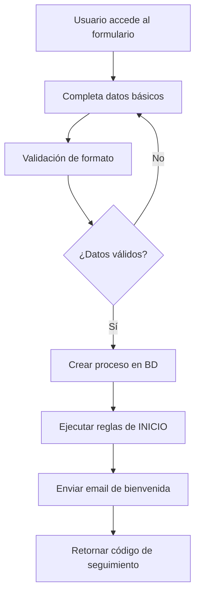
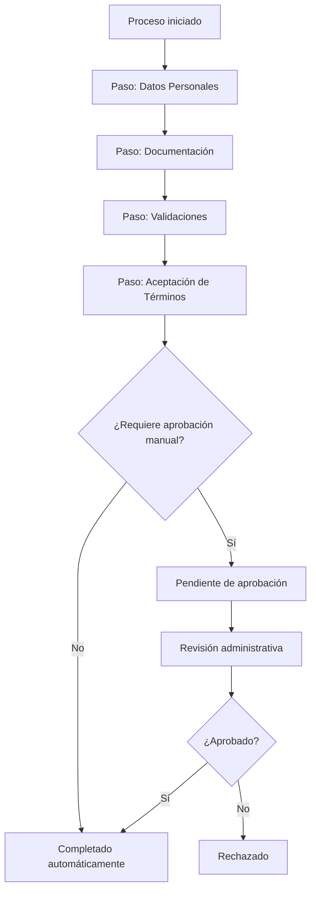

# Sistema de Onboarding para Cooperativas

## 📋 Descripción General

El sistema de onboarding permite a las cooperativas configurar y gestionar procesos de alta de nuevos socios de forma automatizada, aplicando reglas específicas según las necesidades de cada cooperativa.

## 🎯 Características Principales

### 1. **Configuración Flexible**
- ✅ Pasos obligatorios y opcionales personalizables
- ✅ Documentos requeridos configurables
- ✅ Validaciones automáticas (email, teléfono, domicilio)
- ✅ Tiempo límite configurable
- ✅ Aprobación manual opcional

### 2. **Proceso Guiado**
- ✅ Formulario paso a paso
- ✅ Subida de documentos
- ✅ Validaciones en tiempo real
- ✅ Progreso visual
- ✅ Comunicaciones automáticas

### 3. **Reglas de Negocio**
- ✅ Sistema de reglas configurable
- ✅ Validaciones automáticas
- ✅ Integraciones externas
- ✅ Ejecución asíncrona
- ✅ Reintentos automáticos

### 4. **Gestión Administrativa**
- ✅ Dashboard de procesos
- ✅ Aprobación/rechazo manual
- ✅ Estadísticas y métricas
- ✅ Comunicaciones automáticas
- ✅ Gestión de sesiones

## 🏗️ Arquitectura del Sistema

### Modelos de Base de Datos

#### ConfiguracionOnboarding
```typescript
{
  activado: boolean
  requiereAprobacionManual: boolean
  tiempoLimiteOnboarding: number // días
  pasosObligatorios: string[]
  pasosOpcionales: string[]
  documentosRequeridos: string[]
  requiereValidacionEmail: boolean
  emailBienvenida?: string
  // ... más configuraciones
}
```

#### ProcesoOnboarding
```typescript
{
  id: string
  email: string
  nombre: string
  apellido: string
  estado: EstadoOnboarding
  pasoActual: string
  pasosCompletados: string[]
  pasosPendientes: string[]
  codigoReferencia: string
  fechaVencimiento: Date
  // ... más campos
}
```

#### ReglaOnboarding
```typescript
{
  id: string
  nombre: string
  tipoRegla: TipoReglaOnboarding
  condiciones: Json // Lógica de la regla
  acciones: Json // Qué hacer cuando se cumple
  ejecutarEn: EtapaOnboarding[]
  esCritica: boolean
  // ... más configuraciones
}
```

## 🚀 API Endpoints

### Proceso de Onboarding (Público)

#### Iniciar Proceso
```http
POST /cooperativas/:cooperativaId/onboarding
Content-Type: application/json

{
  "email": "socio@email.com",
  "nombre": "Juan",
  "apellido": "Pérez",
  "telefono": "+5491123456789",
  "documento": "12345678",
  "tipoDocumento": "DNI",
  "domicilio": "Av. Libertador 1234",
  "localidad": "Buenos Aires",
  "provincia": "Buenos Aires",
  "codigoPostal": "1425"
}
```

#### Obtener Estado del Proceso
```http
GET /cooperativas/:cooperativaId/onboarding/:procesoId
```

#### Actualizar Datos
```http
PUT /cooperativas/:cooperativaId/onboarding/:procesoId/datos
Content-Type: application/json

{
  "telefono": "+5491198765432",
  "domicilio": "Nueva dirección 5678"
}
```

#### Subir Documento
```http
POST /cooperativas/:cooperativaId/onboarding/:procesoId/documentos
Content-Type: multipart/form-data

archivo: [FILE]
nombre: "DNI Frente"
tipoDocumento: "DNI"
descripcion: "Documento de identidad - frente"
```

#### Validar Email
```http
POST /cooperativas/:cooperativaId/onboarding/:procesoId/validar-email
Content-Type: application/json

{
  "codigo": "123456"
}
```

#### Completar Paso
```http
POST /cooperativas/:cooperativaId/onboarding/:procesoId/completar-paso
Content-Type: application/json

{
  "nombrePaso": "ACEPTACION_TERMINOS",
  "datos": {
    "aceptaTerminos": true,
    "aceptaPrivacidad": true,
    "fechaAceptacion": "2024-01-15T10:30:00Z"
  }
}
```

### Gestión Administrativa (Protegido)

#### Listar Procesos
```http
GET /cooperativas/:cooperativaId/onboarding?estado=PENDIENTE_APROBACION
Authorization: Bearer <token>
```

#### Aprobar/Rechazar Proceso
```http
POST /cooperativas/:cooperativaId/onboarding/:procesoId/decision
Authorization: Bearer <token>
Content-Type: application/json

{
  "aprobado": true,
  "observaciones": "Documentación completa y verificada"
}
```

#### Estadísticas
```http
GET /cooperativas/:cooperativaId/onboarding/estadisticas
Authorization: Bearer <token>
```

### Configuración (Protegido)

#### Obtener Configuración
```http
GET /cooperativas/:cooperativaId/onboarding/configuracion
Authorization: Bearer <token>
```

#### Actualizar Configuración
```http
PUT /cooperativas/:cooperativaId/onboarding/configuracion
Authorization: Bearer <token>
Content-Type: application/json

{
  "activado": true,
  "requiereAprobacionManual": false,
  "tiempoLimiteOnboarding": 30,
  "pasosObligatorios": ["DATOS_PERSONALES", "DOCUMENTACION", "ACEPTACION_TERMINOS"],
  "documentosRequeridos": ["DNI", "COMPROBANTE_DOMICILIO"],
  "requiereValidacionEmail": true
}
```

#### Gestión de Reglas
```http
GET /cooperativas/:cooperativaId/onboarding/configuracion/reglas
POST /cooperativas/:cooperativaId/onboarding/configuracion/reglas
PUT /cooperativas/:cooperativaId/onboarding/configuracion/reglas/:reglaId
DELETE /cooperativas/:cooperativaId/onboarding/configuracion/reglas/:reglaId
```

## 📊 Flujo del Proceso

### 1. Inicio del Proceso


### 2. Progreso del Proceso


### 3. Estados del Proceso
- **INICIADO**: Proceso creado, datos básicos ingresados
- **EN_PROGRESO**: Usuario completando pasos
- **PENDIENTE_VALIDACION**: Esperando validaciones automáticas
- **PENDIENTE_APROBACION**: Esperando revisión manual
- **COMPLETADO**: Proceso finalizado exitosamente
- **RECHAZADO**: Proceso rechazado por administrador
- **CANCELADO**: Proceso cancelado por usuario
- **EXPIRADO**: Proceso vencido por tiempo límite

## ⚙️ Tipos de Reglas Disponibles

### 1. VALIDACION_DATOS
- Verifica formato y consistencia de datos
- Valida duplicados en el sistema
- Aplica reglas de negocio específicas

### 2. VERIFICACION_IDENTIDAD
- Validación de documentos de identidad
- Verificación con bases de datos externas
- Detección de fraudes

### 3. COMPROBACION_DOMICILIO
- Validación de códigos postales
- Verificación con servicios de geolocalización
- Comprobación de comprobantes de domicilio

### 4. INTEGRACION_EXTERNA
- Consultas a AFIP, ANSES, etc.
- Verificaciones crediticias
- APIs de terceros

### 5. CREACION_CUENTA
- Creación automática de usuario
- Asignación de roles
- Configuración inicial de servicios

### 6. NOTIFICACION
- Envío de emails automáticos
- SMS de confirmación
- Notificaciones push

## 🎨 Ejemplos de Configuración

### Cooperativa Básica
```json
{
  "activado": true,
  "requiereAprobacionManual": false,
  "tiempoLimiteOnboarding": 15,
  "pasosObligatorios": [
    "DATOS_PERSONALES",
    "DOCUMENTACION",
    "ACEPTACION_TERMINOS"
  ],
  "documentosRequeridos": ["DNI"],
  "requiereValidacionEmail": true,
  "crearCuentaAutomatica": true
}
```

### Cooperativa con Alta Seguridad
```json
{
  "activado": true,
  "requiereAprobacionManual": true,
  "tiempoLimiteOnboarding": 45,
  "pasosObligatorios": [
    "DATOS_PERSONALES",
    "DOCUMENTACION",
    "VERIFICACION_IDENTIDAD",
    "COMPROBACION_DOMICILIO",
    "REFERENCIAS",
    "ACEPTACION_TERMINOS"
  ],
  "documentosRequeridos": [
    "DNI",
    "COMPROBANTE_DOMICILIO",
    "COMPROBANTE_INGRESOS",
    "REFERENCIAS_LABORALES"
  ],
  "requiereValidacionEmail": true,
  "requiereValidacionTelefono": true,
  "requiereValidacionDomicilio": true,
  "integrarConSistemaContable": true
}
```

## 🔒 Seguridad y Permisos

### Permisos Requeridos
- **ONBOARDING:READ** - Ver procesos y configuración
- **ONBOARDING:CREATE** - Crear reglas y configuración
- **ONBOARDING:UPDATE** - Modificar configuración y aprobar procesos
- **ONBOARDING:DELETE** - Eliminar reglas

### Validaciones de Seguridad
- ✅ Usuarios solo pueden acceder a su cooperativa
- ✅ Procesos públicos con validación de origen
- ✅ Archivos sanitizados y validados
- ✅ Límites de tamaño y tipo de archivo
- ✅ Rate limiting en endpoints públicos

## 📈 Métricas y Estadísticas

### Métricas Disponibles
- Total de procesos iniciados
- Tasa de conversión (completados/iniciados)
- Tiempo promedio de completación
- Procesos por estado
- Documentos más rechazados
- Pasos donde más abandonan

### Dashboard Administrativo
- Gráficos de tendencias
- Alertas de procesos expirados
- Reportes de actividad
- Comparación entre períodos

## 🚧 Próximas Funcionalidades

- [ ] **Plantillas de Email** personalizables
- [ ] **Wizard de Configuración** guiado
- [ ] **Integraciones** con servicios externos
- [ ] **Notificaciones Push** en tiempo real
- [ ] **Análisis de Abandono** con IA
- [ ] **Firma Digital** de documentos
- [ ] **Videollamadas** para verificación
- [ ] **Chatbot** de asistencia

## 💡 Casos de Uso

### Cooperativa de Servicios Públicos
- Validación automática de domicilio
- Verificación de factibilidad técnica
- Creación automática de cuenta de servicios
- Integración con sistema de facturación

### Cooperativa de Trabajo
- Verificación de antecedentes laborales
- Validación de referencias
- Evaluación de aptitudes
- Proceso de incorporación gradual

### Cooperativa de Crédito
- Evaluación crediticia automática
- Verificación de ingresos
- Análisis de riesgo
- Aprobación por comité

Este sistema proporciona una base sólida y flexible para que cada cooperativa pueda configurar su proceso de onboarding según sus necesidades específicas, automatizando tareas repetitivas y mejorando la experiencia tanto para los nuevos socios como para los administradores.